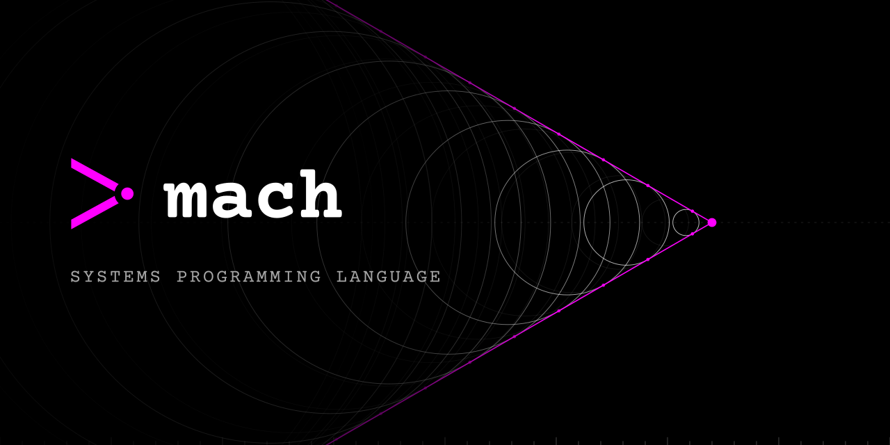

<p align="center">
  <a href="https://machlang.org">
    
  </a>
</p>

<p align="center">
  <a href="https://github.com/briar-systems/mach/actions/workflows/ci.yml?query=branch%3Amain"></a>
  <a href="https://github.com/briar-systems/mach/releases/latest"></a>
  <a href="LICENSE"></a>
  <a href="https://discord.com/invite/dfWG9NhGj7"></a>
</p>

<p align="center">
  <b>A small, explicit systems language for compilers, kernels, runtimes and games:<br>
  anywhere performance is a requirement and hidden behavior is a liability.</b>
</p>

<p align="center">
  <a href="https://machlang.org">machlang.org</a> ·
  <a href="doc/language/README.md">docs</a> ·
  <a href="https://github.com/briar-systems/mach/releases">releases</a> ·
  <a href="CHANGELOG.md">changelog</a> ·
  <a href="https://discord.com/invite/dfWG9NhGj7">discord</a>
</p>


## Install

Linux and macOS:

```sh
curl -fsSL https://machlang.org/install.sh | sh
```

Windows, in PowerShell:

```powershell
irm https://machlang.org/install.ps1 | iex
```

Both install the latest release, to `~/.local/bin` on Linux and macOS and `%LOCALAPPDATA%\mach\bin` on Windows. Precompiled binaries are also on the [releases](https://github.com/briar-systems/mach/releases) page.


## Getting started

```sh
curl -fsSL https://machlang.org/install.sh | sh   # install
mach init hello && cd hello                       # create a project and step into it
mach build .                                      # build it
mach run .                                        # run it
```

`mach init` leaves a working program in `src/main.mach`:

```mach
use std.print;
use std.runtime;

#[symbol("main")]
fun main(argc: i64, argv: **u8) i64 {
    print.println("Hello, World!");
    ret 0;
}
```

> [!NOTE]
> `mach run .` does not build first. Run `mach build .` after every change.

From here, read [the documentation](doc/language/README.md) (a pamphlet, not a bible) or start from [mach-sieve](https://github.com/briar-systems/mach-sieve).


## Principles

- **No hidden control flow.** No exceptions, no destructors, no overloaded operators. Execution goes where the code says and nowhere else.
- **No hidden allocation.** No garbage collector and no runtime quietly reaching for the heap. Memory moves when you move it.
- **Types on the page.** Nothing is inferred. Every binding states its type, so a reader never has to reconstruct what the compiler decided.
- **One toolchain.** A single binary builds, links, tests, formats, vendors dependencies and cross-compiles. Nothing else to install. It cooks and cleans if you ask nicely.

Batteries are not included, there is rarely more than one way to do a thing, and the language will not stop you from doing something dangerous. Safety is a decision the programmer makes, not a restriction imposed on them.


## Nothing happens off the page

Not even the runtime. It is an ordinary module in the standard library that a program opts into by importing `std.runtime`, and `main` is just the function that exports the symbol it calls. The compiler does not provide a runtime and does not know one exists.

```mach
use std.runtime;                  # the runtime is a std module you import
use std.types.error.err;
use std.types.result.res;
use std.types.size.usize;

use A:    std.allocator;
use page: std.allocator.page;

#[symbol("main")]                 # exported by name, for the runtime's _start to call
fun main(argc: i64, argv: **u8) i64 {
    val count: usize = 1024;      # every binding states its type

    var a: A.Allocator;           # the allocator is a value you hold
    page.make(?a);

    # each allocation names its allocator and its type
    val r: res[*u8, A.Error] = A.allocate[u8](?a, count);
    if (sel r.err) {              # failure is a value you check, never thrown
        ret 1;
    }
    val buf: *u8 = r.ok;          # reachable because the error branch returned

    # freed by the same allocator, on the page
    val released: err[A.Error] = A.deallocate[u8](?a, buf, count);
    if (sel released.err) {
        ret 1;
    }

    ret 0;
}
```


## What it's for

**Operating systems, firmware and bootloaders.** Write the kernel, the bootloader and the build tools in one language. Freestanding targets and [inline assembly](doc/language/asm.md) live in the same source as everything else.

```mach
pub fun halt() {
    asm x86_64 {
        cli
        hlt
    }
}
```

**Constant-time cryptography** (experimental preview). Mark a value [secret](doc/language/secrecy.md) and the compiler refuses to let it steer a branch, an index or a timing. Constant-time code, checked instead of hoped for.

```mach
#[oblivious]
fun check(mac: ^u64, want: ^u64) bool {
    if (mac == want) {
        ret true;
    }
    ret false;
}
```

```
error: secret value used as a branch condition
  --> ./src/mac.mach:3:5
```

**GPU compute and shaders.** Vertex, fragment and compute stages are Mach functions. A `spirv` target compiles them straight to a finished SPIR-V module a Vulkan driver loads, with no shading language on the side and no second toolchain. See [shaders](https://machlang.org/docs/shaders.html).

```mach
#[storage(0, 0)]
var particles: Particles;

#[builtin("global_invocation")]
var global_id: u32x3;

#[stage("compute")]
#[workgroup(64, 1, 1)]
fun step() {
    val i: u32 = global_id[0];
    particles.position[i] = particles.position[i] + particles.velocity[i];
}
```


## One source, every target

A target is a fully spelled tuple of isa, os and abi, plus the extensions every host it runs on is promised to have. Declare them once in [`mach.toml`](doc/language/manifest.md) and one command builds every one of them, from a desktop binary to a bare-metal image to a GPU module.

```toml
[target.linux]
isa = "x86_64"
os  = "linux"
abi = "sysv64"
extensions = ["x86-64-v3", "sha"]

[target.board]
isa = "rv32imc"
os  = "freestanding"
abi = "ilp32"

[target.gpu]
isa = "spirv"
os  = "freestanding"
abi = "spirv"
env = "vulkan1.3"
```

```sh
mach build . --all-targets
```

A target's extensions are comptime facts, so one module can carry a hardware path and a portable fallback. The branch a target does not select is dropped before it is type-checked.

```mach
$if ($mach.build.extensions.sha) {
    use impl: app.sha.hw;
}
$or {
    use impl: app.sha.portable;
}
```

| field | values |
|---|---|
| **isa** | x86_64, aarch64, riscv64, riscv32, rv32imc, rv64imafd, …, spirv, wasm32 |
| **os** | linux, darwin, windows, freestanding, wasi |
| **abi** | sysv64, win64, aapcs64, lp64, lp64f, lp64d, ilp32, ilp32f, ilp32d, spirv |
| **format** | elf, coff, macho, raw, spv, wasm |
| **spir-v env** | vulkan1.0, vulkan1.1, vulkan1.2, vulkan1.3 |

x86_64 linux is the primary host. aarch64 linux runs natively in CI, riscv64 linux self-hosts under qemu, darwin self-hosts on both architectures, and windows is a cross-compilation target. `mach info targets` lists every tuple your binary can build.


## Written in Mach

The compiler, code generators and linker are Mach all the way through, with no external dependencies. The standard library uses platform libraries only where it must, such as libSystem on Darwin and the system DLLs on Windows. The language is proven on the hardest program it will ever build: itself. Each generation compiles the next from the same source, and when two in a row come out the same, the compiler has reproduced itself.


## Documentation

[`doc/language/`](doc/language/README.md) is the language reference. [`doc/mach/`](doc/README.md) is the API reference for the compiler itself, generated by `mach doc .`.


## Contributing

Contributions are welcome. Read the [contributing guidelines](CONTRIBUTING.md) first.


## Credit

The inspiration for Mach comes from too many languages to count. Direct inspiration for the compiler itself comes from a few specific sources:

- [Go](https://go.dev/)
- [V](https://vlang.io/)
- [Zig](https://ziglang.org/)
- [Rust](https://www.rust-lang.org/)

Mach stands on the shoulders of countless giants who contributed to these languages, directly or by proxy. It is out of respect for their work that Mach will always be fully open source. Thank you all.

Mach is licensed under the [MIT License](LICENSE).
