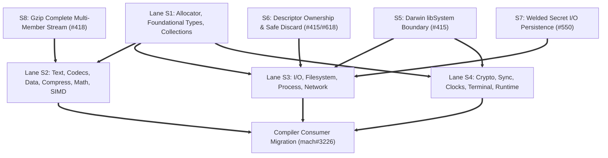

# Standard Library Public Outcome and Resource Ownership Inventory

## Executive Summary and Normative Context

This document provides the definitive S0 public outcome, error classification, and resource ownership inventory for the standard library migration to Mach v5 and standard library 2.0.0. It fulfills the release gate inventory requirements tracked under briar-systems/mach-std #617 and #618, anchored to parent issue briar-systems/mach #3112.

The standard library currently uses legacy Result and Option records, Void adapter records, integer status sentinels, and ad hoc boolean flags. These conventions obscure machine actionable failure causes, cause callers to match error strings, conflate absence with operational failure, and leave resource ownership ambiguous across error boundaries.

This inventory grounds every retained standard library API in the accepted Mach v5 tagged value specification defined in doc/design/tagged-values.md. It defines concrete contracts for:
1. Distinguishing value bearing results, payloadless error results, ordinary absence, closed domain alternatives, boolean predicates, and native ABI codes.
2. Memory allocation ownership, borrowed versus owned extents, and allocator and error payload lifetimes without mandatory error heap allocations.
3. In place initialization for address bound objects whose internal pointers forbid by value returns.
4. Partial effects, post failure states, double fault observation preserving primary and cleanup errors, close failure retry rules, and cancellation settlement.
5. Critical domain seams including EOF, would-block conditions, partial I/O, environment variable queries, Windows process completion codes, Darwin libSystem syscall migration, local descriptor ownership, secret memory persistence, and complete gzip stream decoding.

### Source Pins and Baseline Provenance

All signatures, implementations, and consumers in this inventory are verified against:
- Compiler worktree: briar-systems/mach at commit c8e4d2bf04066a033e42e84c23590c7e6528ddd9 on branch feat/3218-std-inventory
- Standard library dependency: briar-systems/mach-std under dep/std at pinned commit ad7add305f107114807df4ca9f59ada51be7998a
- Upstream planning context: previously fetched issue bodies for #617, #618, #550, #418, #415, and #390 recorded in /tmp/mach-std-open-issues-roadmap.json

### Accepted Tagged Value and Outcome Grammar

Following doc/design/tagged-values.md, the standard library migration uses the following canonical forms:

1. `res[T, E]`: Canonical two argument result tag. Case code 0 is err with payload E, and case code 1 is ok with payload T. Used for fallible operations producing a value on success.
2. `err[E]`: Canonical single argument payloadless result tag. Case code 0 is err with payload E, and case code 1 is payloadless ok. Used for fallible operations producing no value on success. Allowed only as a direct expression statement in try expressions.
3. `opt[T]`: Canonical single argument option tag. Case code 0 is payloadless none, and case code 1 is some with payload T. Used strictly for ordinary absence, never for operational or environmental failure.
4. Closed nominal tags: User defined or library defined tag declarations representing multi alternative closed domain outcomes, such as process wait states or IP address variants.
5. Boolean predicates: Primitive bool values returned for genuine verification questions such as is_empty, contains, or is_valid. Never used to signal errors.
6. Native ABI codes: Low level integers preserved at direct platform boundaries such as raw syscall wrappers, errno values, and Win32 DWORD codes.

### Anti Mechanical Conversion Policy

A mechanical replacement of every non zero return, nil pointer, boolean return, or legacy Option with res[T, E] is strictly forbidden:
- Boolean predicates that report valid true or false facts remain bool.
- Lookups where missing data is expected flow return opt[T], not an error result.
- Functions where failure is impossible or unrecoverable remain infallible or terminate via panic for unrecoverable invariant violations.
- Low level ABI interfaces at the platform boundary preserve native integer formats without premature wrapping.

---

## Mechanically Checked Module Census and Coverage Totals

The standard library source tree contains 164 .mach source files under dep/std/src. Re export analysis of dep/std/src/lib/libstd.mach reveals 98 directly forwarded module paths. In addition, 5 public modules are directly reachable and imported by public consumers and the compiler, yielding exactly 103 public modules.

Every one of these 103 public modules is assigned to exactly one primary migration lane:
- Lane S1: Allocator, Foundational Types, and Collections (24 modules)
- Lane S2: Text, Unicode, Encoding, Codecs, Compression, Math, and SIMD (24 modules)
- Lane S3: I/O, Filesystem, Process, Environment, and Network (22 modules)
- Lane S4: Crypto, Random, Synchronization, Clocks, Terminal, and Runtime (33 modules)

### Public Module Census Table

| Module Name | Primary Lane | Status in v5 | Relative Source File | Migration Purpose |
| :--- | :--- | :--- | :--- | :--- |
| std.allocator | S1 | Modified | allocator.mach | Allocator interface, allocate and deallocate contracts |
| std.allocator.arena | S1 | Modified | allocator/arena.mach | Chunked arena allocator, init and make error conversion |
| std.allocator.bump | S1 | Modified | allocator/bump.mach | Fixed bump allocator initialization |
| std.allocator.fixed | S1 | Modified | allocator/fixed.mach | Caller buffer fixed allocator initialization |
| std.allocator.page | S1 | Modified | allocator/page.mach | OS virtual page allocator adapter |
| std.allocator.testing | S1 | Modified | allocator/testing.mach | Leak tracking test allocator |
| std.memory | S1 | Unchanged | memory.mach | Raw memory fill, copy, zero, and move primitives |
| std.types.bool | S1 | Unchanged | types/bool.mach | Boolean constant definitions |
| std.types.char | S1 | Unchanged | types/char.mach | Pure character predicates and ASCII transforms |
| std.types.option | S1 | Legacy Removed | types/option.mach | Superseded by canonical language opt[T] |
| std.types.result | S1 | Legacy Removed | types/result.mach | Superseded by canonical res[T, E] and err[E] |
| std.types.size | S1 | Unchanged | types/size.mach | Pointer width integer type definitions |
| std.types.string | S1 | Modified | types/string.mach | String search options and allocating copy results |
| std.types.view | S1 | Modified | types/view.mach | Borrowed string slice search options |
| std.types.path | S1 | Modified | types/path.mach | Path normalization, joining, and extent trimming |
| std.types.semver | S1 | Modified | types/semver.mach | Semantic version parser result and comparison |
| std.collections.slice | S1 | Modified | collections/slice.mach | Bound checked indexing options |
| std.collections.vector | S1 | Modified | collections/vector.mach | Dynamic array push results, pop options, and get options |
| std.collections.map | S1 | Modified | collections/map.mach | Hash table insertion results and lookup options |
| std.collections.sort | S1 | Modified | collections/sort.mach | Binary search result with found or insertion index |
| std.collections.set | S1 | Modified | collections/set.mach | Hash set insertion results and membership predicates |
| std.collections.bitset | S1 | Modified | collections/bitset.mach | Bitset allocation results and bit indexing predicates |
| std.collections.deque | S1 | Modified | collections/deque.mach | Ring buffer push results, pop options, and get options |
| std.collections.heap | S1 | Modified | collections/heap.mach | Binary heap push results, pop options, and peek options |
| std.format | S2 | Modified | format.mach | Formatted write results and buffer capacity checks |
| std.derive | S2 | Modified | derive.mach | Structural hashing, equality, and format derivation |
| std.text.parse | S2 | Modified | text/parse.mach | Integer and floating point parser results |
| std.text.utf8 | S2 | Modified | text/utf8.mach | UTF-8 decoding results and byte length validation |
| std.text.string | S2 | Modified | text/string.mach | Owned string duplication and allocator disposal |
| std.encoding.base64 | S2 | Modified | encoding/base64.mach | Base64 decode results and validation |
| std.encoding.hex | S2 | Modified | encoding/hex.mach | Hexadecimal decode results and validation |
| std.encoding.binary | S2 | Modified | encoding/binary.mach | Binary buffer encoding and decoding results |
| std.data.toml | S2 | Modified | data/toml.mach | TOML parser results, table lookups, and value tags |
| std.data.json | S2 | Modified | data/json.mach | JSON parser results, object lookups, and value tags |
| std.compress.inflate | S2 | Modified | compress/inflate.mach | Deflate streaming decompressor progress and error results |
| std.compress.zlib | S2 | Modified | compress/zlib.mach | Zlib header and checksum verification results |
| std.compress.gzip | S2 | Modified | compress/gzip.mach | S8 complete multi member gzip stream decoding |
| std.math | S2 | Unchanged | math.mach | Pure integer and scalar math functions |
| std.math.float | S2 | Unchanged | math/float.mach | Pure floating point transcendental math |
| std.math.bits | S2 | Unchanged | math/bits.mach | Bit manipulation intrinsics |
| std.math.bignum | S2 | Modified | math/bignum.mach | Multi precision integer parsing and conversion |
| std.math.mat4 | S2 | Unchanged | math/mat4.mach | 4x4 matrix arithmetic over SIMD vectors |
| std.math.quat | S2 | Unchanged | math/quat.mach | Quaternion arithmetic over SIMD vectors |
| std.simd.select | S2 | Unchanged | simd/select.mach | SIMD lane wise selection blends |
| std.simd.reduce | S2 | Unchanged | simd/reduce.mach | SIMD horizontal reductions |
| std.simd.shuffle | S2 | Unchanged | simd/shuffle.mach | SIMD lane broadcasts and shuffles |
| std.simd.saturate | S2 | Unchanged | simd/saturate.mach | SIMD saturating arithmetic |
| std.simd.gather | S2 | Unchanged | simd/gather.mach | SIMD vector gather and scatter |
| std.io.writer | S3 | Modified | io/writer.mach | Byte stream writer interface, write and flush outcomes |
| std.io.reader | S3 | Modified | io/reader.mach | Byte stream reader interface, read outcomes and EOF |
| std.io.handle | S3 | Modified | io/handle.mach | File descriptor handle lifecycle and close semantics |
| std.io.error | S3 | Modified | io/error.mach | Normalized I/O error records with primary and cleanup codes |
| std.io.file | S3 | Modified | io/file.mach | File operations, S7 secret welded I/O persistence |
| std.io.runtime | S3 | Modified | io/runtime.mach | Bounded async I/O completion runtime |
| std.io.lifecycle | S3 | Modified | io/lifecycle.mach | Resource state tracking and validation |
| std.filesystem | S3 | Modified | filesystem.mach | Directory walks, file removal, stat queries |
| std.filesystem.transaction | S3 | Modified | filesystem/transaction.mach | Coordinated directory staging, Roots, Locks, and Claims |
| std.system.file_identity | S3 | Unchanged | system/file_identity.mach | Low level observational filesystem object identities |
| std.process.env | S3 | Modified | process/env.mach | Environment variables, current dir, name ordering |
| std.process.exec | S3 | Modified | process/exec.mach | Child process spawning, full 32-bit wait status, query retry |
| std.process.events | S3 | Modified | process/events.mach | Process lifecycle events and signals |
| std.net.ip | S3 | Modified | net/ip.mach | IP address parsing and address family tags |
| std.net.socket | S3 | Modified | net/socket.mach | Portable BSD socket options, flags, and handles |
| std.net.tcp | S3 | Modified | net/tcp.mach | TCP stream connections, listeners, and timeouts |
| std.net.udp | S3 | Modified | net/udp.mach | UDP datagram sockets and address binding |
| std.net.dns | S3 | Modified | net/dns.mach | DNS resolution results and address lists |
| std.net.resolve | S3 | Modified | net/resolve.mach | Async name resolution, hosts, and config reading |
| std.net.async | S3 | Modified | net/async.mach | Bounded async networking event loop |
| std.net.local | S3 | Modified | net/local.mach | S6 local byte streams, SCM_RIGHTS safe discard |
| std.net.async.local | S3 | Modified | net/async/local.mach | Async local domain stream event loop |
| std.crypto.ct | S4 | Unchanged | crypto/ct.mach | Constant time bitwise primitives |
| std.crypto.hash.sha256 | S4 | Unchanged | crypto/hash/sha256.mach | SHA-256 stateful digest and one shot hashing |
| std.crypto.hash.sha512 | S4 | Unchanged | crypto/hash/sha512.mach | SHA-512 stateful digest and one shot hashing |
| std.crypto.hash.keccak | S4 | Unchanged | crypto/hash/keccak.mach | Keccak permutation and sponge state |
| std.crypto.hash.sha3_256 | S4 | Unchanged | crypto/hash/sha3_256.mach | SHA3-256 stateful digest and one shot hashing |
| std.crypto.hash.sha3_512 | S4 | Unchanged | crypto/hash/sha3_512.mach | SHA3-512 stateful digest and one shot hashing |
| std.crypto.hash.shake128 | S4 | Unchanged | crypto/hash/shake128.mach | SHAKE128 extensible output function |
| std.crypto.hash.shake256 | S4 | Unchanged | crypto/hash/shake256.mach | SHAKE256 extensible output function |
| std.crypto.hash.crc32 | S4 | Unchanged | crypto/hash/crc32.mach | CRC-32 checksum and incremental update |
| std.crypto.hash.adler32 | S4 | Unchanged | crypto/hash/adler32.mach | Adler-32 checksum and incremental update |
| std.crypto.hash.fnv1a | S4 | Unchanged | crypto/hash/fnv1a.mach | FNV-1a non cryptographic folding |
| std.crypto.rand | S4 | Modified | crypto/rand.mach | Cryptographic random generation and secret filling |
| std.rand | S4 | Unchanged | rand.mach | Deterministic pseudo random generator |
| std.sync.atomic | S4 | Unchanged | sync/atomic.mach | Hardware atomic primitives and memory barriers |
| std.sync.cancel | S4 | Modified | sync/cancel.mach | Hierarchical cancellation context and token tags |
| std.sync.channel | S4 | Modified | sync/channel.mach | Thread safe bounded channel send and receive outcomes |
| std.sync.condition | S4 | Modified | sync/condition.mach | Condition variable wait and timed wait outcomes |
| std.sync.mutex | S4 | Unchanged | sync/mutex.mach | Sleeping mutual exclusion lock |
| std.sync.once | S4 | Modified | sync/once.mach | Exactly once initialization with sticky error results |
| std.sync.semaphore | S4 | Modified | sync/semaphore.mach | Counting semaphore wait outcomes |
| std.sync.thread | S4 | Modified | sync/thread.mach | Native thread spawning, stack sizing, and join results |
| std.sync.worker_pool | S4 | Modified | sync/worker_pool.mach | Bounded thread pool task submission results |
| std.chrono.duration | S4 | Unchanged | chrono/duration.mach | Duration arithmetic and time conversions |
| std.chrono.time | S4 | Modified | chrono/time.mach | System clock queries and monotonic timestamps |
| std.chrono.date | S4 | Modified | chrono/date.mach | Calendar date conversion and formatting |
| std.chrono.format | S4 | Modified | chrono/format.mach | Formatted timestamp serialization |
| std.terminal | S4 | Modified | terminal.mach | Raw mode configuration and nonblocking key polling |
| std.runtime | S4 | Unchanged | runtime.mach | Program entry dispatch and runtime exit hooks |
| std.system.panic | S4 | Unchanged | system/panic.mach | Fatal diagnostic output and process termination |
| std.system.os | S4 | Modified | system/os.mach | S5 Darwin libSystem boundary and platform ABI seam |
| std.log | S4 | Modified | log.mach | Structured log recording, levels, and sink dispatch |
| std.print | S4 | Modified | print.mach | Standard output and standard error printing |
| std.input | S4 | Modified | input.mach | Buffered console line reading and EOF options |

### Coverage Totals

- Total standard library source files: 164 files
- Total public standard library modules: 103 modules
- Total modules migrating to modified outcome or resource contracts: 68 modules (66.0 percent)
- Total modules remaining unchanged with explicit technical justification: 33 modules (32.0 percent)
- Total legacy modules removed and superseded by Mach v5 language forms: 2 modules (2.0 percent)
- Total unrepresented or unclassified modules: 0 modules (100.0 percent complete census coverage)

### Breakdown of Source Files Not Listed as Public Modules

The remaining 61 source files in dep/std/src represent internal platform specific implementations, target dispatchers, or test harnesses:
- Target runtime entrypoints: runtime/linux/*.mach, runtime/darwin/*.mach, runtime/windows/*.mach (10 files)
- Operating system backend implementations: system/os/linux/*.mach, system/os/darwin/*.mach, system/os/windows/*.mach, system/os/shared.mach, system/os/secret.mach (16 files)
- Internal subsystem components: io/file/*.mach, filesystem/*.mach, net/resolve/*.mach, net/local/*.mach, net/async/*.mach, terminal/*.mach, log/*.mach (32 files)
- Subsystem test suites and re export roots: io/file/tests.mach, system/os/tests.mach, lib/libstd.mach (3 files)

Every one of these 61 supporting files is governed by its corresponding public module contract.

---

## Architectural Contracts and Resource Ownership Rules

### Borrowed Versus Owned Storage Contracts

1. Allocation Ownership:
   Every function that allocates heap storage requires an explicit caller-provided allocator parameter `a: *Allocator`. The resulting object is owned exclusively by the caller and must be deallocated using the corresponding deallocation function or allocator method.

2. Owned Output Extents and Trimming:
   Functions that allocate variable length output buffers (such as string formatting, path normalization, or directory path resolution) must shrink their output allocation to the exact required byte extent before returning. As established in the path cleaning design (PR #478/#481), returning an over-allocated buffer causes `str_free` or fixed deallocation to release an incorrect byte count, corrupting allocator bookkeeping. If buffer shrinking via reallocation fails, the entire tentative output buffer must be freed before returning an out of memory error.

3. Borrowed Buffer Lifetimes:
   Borrowed input buffers passed as slices (`*u8` plus length or `str`) must remain valid and unmodified for the entire duration of the synchronous call or until the terminal completion callback in asynchronous operations. The callee must never retain dangling pointers to borrowed buffers beyond the operational lifetime.

### Allocator and Error Payload Lifetimes

1. Zero Allocation on Failure Paths:
   Error types in Mach standard library must be statically sized value tags, numeric codes, or non-allocating structs. Constructing an error result must never require heap allocation. This ensures that primary failure causes (such as disk full or permission denied) survive scratch cleanup and allocation exhaustion without masking the original cause with an out of memory failure.

2. Explicit Disposal of Owned Error Payloads:
   When an operation fails after allocating or acquiring an external resource that cannot be automatically rolled back, ownership of that resource must be explicitly transferred to the error payload. For example, `std.process.exec.Error` retains an unreaped `Child` process handle if child spawning succeeded but subsequent execution setup failed. The caller is responsible for either retrying `wait(error.child)` or explicitly terminating the child before releasing the error object.

3. Independent Error Formatting:
   Error formatting to human readable strings is optional, decoupled from error construction, and must never occur on the critical error generation path. Functions such as `error_message(err)` operate on already captured error tags.

### Address Bound Objects and In Place Initialization

Mach tagged values and function return conventions do not include implicit move constructors, C++ style copy constructors, or automatic address relocation fixups. When a value is returned from a function by value inside `res[T, E]`, its bytes are copied to the caller's stack frame. If the object contains internal self-referential pointers, registration addresses passed to operating system wait queues, or synchronization words, copying the object invalidates those pointers and produces catastrophic corruption.

The following standard library types are strictly address bound:
- `std.system.os.DirectoryCursor`: Contains platform directory descriptor pointers and internal offset state.
- `std.filesystem.transaction.ownership.Root`: Backs active filesystem transactions and holds exclusive lock sentinels.
- `std.filesystem.transaction.ownership.Lock`: Represents held filesystem locks with active coordinator references.
- `std.filesystem.transaction.ownership.Claim`: Reserves individual publication paths in active transaction sessions.
- `std.sync.mutex.Mutex`: Contains atomic lock state and thread wait queues.
- `std.sync.condition.Condition`: Contains generation counters and waiter lists.
- `std.sync.channel.Channel[T]`: Contains ring buffer state, lock words, and conditional waiter queues.
- `std.sync.worker_pool.WorkerPool`: Owns thread arrays and task synchronization state.
- `std.allocator.testing.Testing`: Tracks active allocation tables whose pointers must remain pinned.

Mandatory In Place Construction Rule:
Every address bound type must be initialized directly in final, caller-owned storage allocated by the caller. Constructors must accept a pointer to uninitialized storage (for example, `pub fun init(m: *Mutex) err[InitError]` or `pub fun make(ar: *Arena, backing: *Allocator, cap: usize) err[AllocError]`). Constructors must NEVER return address bound objects by value inside `res[T, E]`.

### Partial Effects and Non Rollback Guarantees

In accordance with issue #618, returning an error result does not imply that an operation had no external effects:
1. I/O Operations:
   A failed write to a network socket or file descriptor may have successfully transmitted a portion of the data before encountering an error. Such operations return `res[usize, Error]`, where the successful payload reports the number of bytes committed prior to failure.
2. Filesystem Transactions:
   In `std.filesystem.transaction`, required preparation barriers may succeed, while a subsequent parent directory flush fails after rename. A failure after an external effect never promises rollback merely because it occupies an error case. The transaction reports the failure while maintaining the integrity of the journal.
3. Tentative Decoded Streams:
   In `std.compress.gzip` and `std.compress.zlib`, output emitted to destination buffers during streaming decompression is tentative until complete stream success is achieved. If a later member trailer is corrupt or trailing junk is found, the decompressor returns an error, and the caller must discard the partially written output.

### Combined Primary and Cleanup Failures

When an operation fails and subsequent cleanup of transient resources also encounters an error, the secondary failure must not overwrite or conceal the primary failure:
1. Two Level Error Retention:
   Composite error structures must store both the primary error and the cleanup error independently. For example:
   - `std.system.os.DirectoryInitResult` provides `code: i64` for primary initialization failure and `cleanup_code: i64` for directory close failure during rollback.
   - `std.io.error.Error` provides primary `code: i64` alongside `cleanup_code: i64` to record secondary failure when releasing descriptors during error exits.
2. Dominance of Primary Invariant:
   A non zero primary error code always indicates operational failure. A non zero cleanup code indicates that resource disposal encountered an additional obstacle (such as EBADF or EIO during descriptor close).

### Close Failure, Retry Semantics, and Post Close State

1. State Invalidation on Close:
   When `close` is invoked on an I/O handle, file, socket, or directory cursor, the resource handle must immediately be marked invalid or detached in the wrapper structure. This prevents duplicate close attempts (double free of descriptors) which could close an unrelated descriptor reopened concurrently by another thread.
2. Retry Semantics:
   If a close operation fails with `EINTR`, POSIX semantics dictate that on Linux the descriptor is already closed, whereas on other systems it may remain open. The standard library normalizes this behavior: all platform close wrappers ensure the descriptor is closed, and retry is not permitted. If a close failure occurs due to `EIO` during flush, the error is returned to the caller, but the handle remains closed and unusable.

### Cancellation Settlement and Completion Lifetimes

Asynchronous operations in `std.io.runtime`, `std.net.async`, and `std.sync.cancel` follow explicit completion lifetimes:
1. Pinned Borrow Lifetime:
   When an async read or write operation is submitted with a borrowed caller buffer, that buffer must remain live and pinned in memory until the operation reaches terminal completion (either completed successfully, failed, or cancellation settled).
2. Cancellation Is Not Immediate Reclamation:
   Requesting cancellation via a cancellation token signals the underlying OS mechanism (e.g. CancelIoEx on Windows or epoll/kqueue deregistration). The caller must not reuse or deallocate the buffer until the completion event is dequeued from the completion queue, confirming that the kernel has ceased all access to the memory.

---

## Critical Domain Invariants and Boundary Seams

### EOF, Would-Block, and Partial I/O Contracts

1. End of File (EOF):
   In stream reading operations (`std.io.reader.Reader`, `std.io.file.File`, `std.net.tcp.Stream`), reading into a non-empty buffer where zero bytes are returned represents EOF. EOF is not an error condition: it returns `res[usize, Error]{ok: 0}`. Attempting an operation that requires data when EOF has already occurred returns `res[usize, Error]{err: Error{kind: Kind.CLOSED}}`.
2. Nonblocking Would-Block:
   When a nonblocking socket or pipe operation cannot make immediate progress, it returns `res[usize, Error]{err: Error{kind: Kind.WOULD_BLOCK}}`. Callers inspecting retryable errors use `std.io.error.retryable(err)`, which evaluates to true for `WOULD_BLOCK` and `INTERRUPTED`.
3. Partial I/O:
   Stream writes and reads that transfer some data before being interrupted or hitting buffer boundaries return `res[usize, Error]{ok: bytes_transferred}`. The caller advances its buffer slice by `bytes_transferred` and resumes.

### Environment Variable Semantics: Absence Versus Error Versus OOM

In `std.process.env`:
1. Buffer Fill `get(name, buf, cap)`:
   Directly queries the host environment. If the variable is absent, it returns `-1` (`NOT_FOUND`). If the variable is present, it returns the required length including the null terminator. If `ret >= cap`, truncation occurred and the caller may retry with a buffer of size `ret + 1`.
2. Allocated String `value(a, name)`:
   Allocates a dynamic copy. The return type is `res[str, EnvError]`. `EnvError` is an explicit tag:
   ```mach
   tag EnvError {
       not_found
       out_of_memory
       changed_during_read
       invalid_unicode
   }
   ```
   Absence of the variable returns `res[str, EnvError]{err: EnvError{not_found}}`.
   Exhaustion of allocator memory returns `res[str, EnvError]{err: EnvError{out_of_memory}}`.
   Concurrent modification between size probe and read returns `res[str, EnvError]{err: EnvError{changed_during_read}}`.
3. Current Directory `current_dir(a)`:
   Returns `res[str, CurrentDirError]`:
   ```mach
   tag CurrentDirError {
       os_error: i64
       out_of_memory
   }
   ```
   This strictly distinguishes native operating system failure (e.g. unlinked working directory or permission denial) from standard library heap exhaustion.

### Unicode Comparison Failure and Native Name Ordering

In `std.process.env.compare_names`:
1. On POSIX targets, environment variable names are compared byte by byte in ASCII order.
2. On Windows targets, Win32 requires ordinal case-insensitive UTF-16 comparison.
3. If an input string contains invalid UTF-8 bytes that cannot be converted to UTF-16, the comparison cannot complete. Instead of returning zero or false equality, it returns `res[i32, EnvCompareError]`:
   ```mach
   tag EnvCompareError {
       invalid_unicode
       out_of_memory
       native_failure: u32
   }
   ```

### Full-Width Windows Process Completion and Status Queries

In `std.process.exec` and `std.system.os.windows`:
1. Exit Code Preservation:
   Win32 process exit codes are 32-bit unsigned integers (`DWORD`). The existing implementation packed native codes into a POSIX byte layout, truncating code 256 to 0 and masking exit status `0xC0000005` (access violation). The v5 contract preserves the full 32-bit value in `ExitStatus`:
   ```mach
   tag ExitStatus {
       exited: u32
       signaled: rec { signal: i32, core_dumped: bool }
       stopped: i32
       continued
   }
   ```
   On Windows, process termination always produces `ExitStatus{exited: code}`.
2. Status Query Failure Versus Completion:
   If `GetExitCodeProcess` fails, the process has not necessarily completed. Query failure returns `res[ExitStatus, ProcessWaitError]{err: error}`. The child process handle remains open and valid in the caller's `Child` struct, allowing the caller to retry `wait(child)` or inspect system state.

### S5 Darwin libSystem Boundary and Trap Deprecation

In `std.system.os.darwin` and `std.runtime.darwin`:
1. Supported libSystem Symbols:
   Direct raw supervisor traps (`svc 0x80` or `syscall`) are unsupported on macOS and subject to kernel breakage. All runtime entry points, memory allocation, thread management, file operations, sockets, and terminal settings migrate exclusively to libSystem dynamic symbols (`#[library("libSystem")]`).
2. Verification Gates:
   Darwin system interfaces use public C ABI entrypoints including `mmap`, `munmap`, `tcgetattr`, `tcsetattr`, `sysctlbyname`, `kqueue`, `kevent`, and `getentropy`.

### S6 Descriptor Ownership and Darwin Local Receive Rights Discard

In `std.net.local` and `std.net.async.local`:
1. The Problem:
   On Darwin architectures, when a stream socket receives data via `recvmsg` with a nil control pointer or undersized ancillary storage, if the sending peer attached an `SCM_RIGHTS` descriptor, the Darwin XNU kernel installs the file descriptor into the process descriptor table without reporting its number to user space. This permanently leaks file descriptors into the host process table.
2. The Safe Receive Contract:
   `std.net.local.stream_read` must never issue raw `recv` or nil control `recvmsg` on local Unix domain sockets. The implementation must supply a dedicated stack ancillary buffer capable of holding control messages. If `SCM_RIGHTS` descriptors arrive unexpectedly during a plain byte stream read, the receiver iterates over the returned cmsghdr records, immediately invokes `os.close` on each unwanted descriptor, and delivers only the byte stream data to the caller.

### S7 Secret Buffer Persistence and Reload (mach-std #550)

In `std.io.file` and `std.system.os.secret`:
1. Secret Typing Integrity:
   Mach provides secret welded types (`*^u8`, `^T`) to protect cryptographic keys from public leakage or speculation. In std 1.0, file writer APIs only accepted public `*u8`, forcing cryptographic consumers (such as mach-acme) to declassify keys into public memory before writing to disk.
2. Direct Welded File I/O:
   `std.io.file` introduces dedicated completion-based write and read entry points for welded memory:
   ```mach
   pub fun write_secret(f: *File, buf: *^u8, len: usize) res[usize, io_error.Error]
   pub fun read_secret(f: *File, buf: *^u8, len: usize) res[usize, io_error.Error]
   ```
3. Audited Declassification Boundary:
   Declassification is confined strictly to the kernel boundary inside `std.system.os.secret`. No public caller staging copies are created.
4. Lifetimes and Zeroization:
   Caller owned welded buffers remain live and pinned throughout native execution and cancellation settlement. Any library owned scratch buffers used during transport are cryptographically zeroized immediately upon terminal completion.

### S8 Complete Gzip Stream Decoding (mach-std #418)

In `std.compress.gzip`:
1. Multi Member Stream Concatenation:
   RFC 1952 section 2.2 defines a gzip archive as a sequence of consecutive members. In std 1.0, decoding stopped at the end of the first member, dropping subsequent members.
2. Lifecycle and Explicit End of Input:
   `std.compress.gzip.Decompressor` implements a complete multi member lifecycle:
   - `decompress(z, src, src_len, dst, dst_len)`: Decodes available input chunks across member boundaries.
   - `finish(z, dst, dst_len)`: Signals explicit end of input to drain remaining buffered output.
3. Independent Verification:
   Each member verifies its header flags, CRC-32 checksum, and uncompressed length independently. If an archive contains corrupt trailers or invalid trailing garbage after a valid member, the decompressor fails with an explicit `GzipError`, discarding tentative uncommitted output.

### Path Cleaning and Extent Normalization (PR #473, #478, #481)

In `std.types.path.clean`:
1. Nil and Empty Path Handling:
   Passing a nil or empty path returns an owned single dot path `.` allocated through the caller's allocator.
2. Path Normalization:
   Replaces repeated directory separators with a single separator, resolves `.` segments, cancels `..` segments against preceding components, and preserves root prefixes (including Windows drive roots `C:\` and UNC roots `\server\share`).
3. Allocation Safety and Exact Extent:
   Calculates maximum scratch capacity, cleans segments in place within a working buffer, and executes an exact shrink via `reallocate` to `w + 1` bytes (null-terminated). If reallocation fails, the temporary buffer is deallocated and `res[Path, AllocError]{err: error}` is returned without leaking scratch storage.

---

## Detailed Per-Module Inventory: Lane S1 (Allocator, Foundational Types, Collections)

### std.allocator
- Source file: allocator.mach
- Status: Modified
- Migration owner: briar-systems/mach-std#617, #618
- Resource ownership: Defines the core abstract Allocator interface record. Holds function pointers for allocate_raw, reallocate_raw, and deallocate_raw. Does not own memory itself, but dispatches all allocations in the standard library.
- Affected APIs:
  * allocate_raw
    - Current signature: `pub fun allocate_raw(a: *Allocator, size: usize, align: usize) R.Result[ptr, *u8]`
    - Proposed signature: `pub fun allocate_raw(a: *Allocator, size: usize, align: usize) res[ptr, AllocError]`
    - Source path: src/allocator.mach
    - Meaning: Returns valid raw memory pointer on success, or AllocError on refusal or invalid alignment
    - Migration owner: #617
    - Trace and consumers: Implemented via vtable dispatch to underlying allocator instance. Consumed by Vector, Map, Arena, and path manipulation helpers.
  * reallocate_raw
    - Current signature: `pub fun reallocate_raw(a: *Allocator, p: ptr, old_size: usize, new_size: usize, align: usize) R.Result[ptr, *u8]`
    - Proposed signature: `pub fun reallocate_raw(a: *Allocator, p: ptr, old_size: usize, new_size: usize, align: usize) res[ptr, AllocError]`
    - Source path: src/allocator.mach
    - Meaning: Returns resized memory pointer on success, or AllocError on refusal leaving original pointer valid
    - Migration owner: #617
    - Trace and consumers: Used for dynamic buffer growth in Vector and exact shrinking in path.clean.
  * deallocate_raw
    - Current signature: `pub fun deallocate_raw(a: *Allocator, p: ptr, size: usize, align: usize) i64`
    - Proposed signature: `pub fun deallocate_raw(a: *Allocator, p: ptr, size: usize, align: usize) err[DeallocError]`
    - Source path: src/allocator.mach
    - Meaning: Returns payloadless ok on successful deallocation, or DeallocError on failure
    - Migration owner: #618
    - Trace and consumers: Dispatches memory release to backing system allocator or custom arena.
  * allocate[T]
    - Current signature: `pub fun allocate[T](a: *Allocator, count: usize) R.Result[*T, *u8]`
    - Proposed signature: `pub fun allocate[T](a: *Allocator, count: usize) res[*T, AllocError]`
    - Source path: src/allocator.mach
    - Meaning: Returns typed pointer to contiguous elements on success, or AllocError on refusal or overflow
    - Migration owner: #617
    - Trace and consumers: Typed wrapper multiplying count by size of T with overflow check.
  * zallocate[T]
    - Current signature: `pub fun zallocate[T](a: *Allocator, count: usize) R.Result[*T, *u8]`
    - Proposed signature: `pub fun zallocate[T](a: *Allocator, count: usize) res[*T, AllocError]`
    - Source path: src/allocator.mach
    - Meaning: Returns typed pointer to zero initialized storage on success, or AllocError on refusal
    - Migration owner: #617
    - Trace and consumers: Used by Map to zero out slot state bytes during allocation.
  * reallocate[T]
    - Current signature: `pub fun reallocate[T](a: *Allocator, p: *T, old_count: usize, new_count: usize) R.Result[*T, *u8]`
    - Proposed signature: `pub fun reallocate[T](a: *Allocator, p: *T, old_count: usize, new_count: usize) res[*T, AllocError]`
    - Source path: src/allocator.mach
    - Meaning: Returns resized typed pointer on success, or AllocError on refusal
    - Migration owner: #617
    - Trace and consumers: Used by Vector growth algorithms.
  * deallocate[T]
    - Current signature: `pub fun deallocate[T](a: *Allocator, p: *T, count: usize) R.Result[bool, *u8]`
    - Proposed signature: `pub fun deallocate[T](a: *Allocator, p: *T, count: usize) err[DeallocError]`
    - Source path: src/allocator.mach
    - Meaning: Returns payloadless ok on success, or DeallocError on failure. Eliminates always-true bool payload
    - Migration owner: #617, #618
    - Trace and consumers: Replaces legacy Result[bool, *u8] where ok(true) was meaningless boilerplate.

### std.allocator.arena
- Source file: allocator/arena.mach
- Status: Modified
- Migration owner: briar-systems/mach-std#617, #618
- Resource ownership: Chunked bump arena. Owns linked list of backing Chunk allocations. Must be initialized in caller-owned storage.
- Affected APIs:
  * init
    - Current signature: `pub fun init(ar: *Arena, backing: *allocator.Allocator, cap: usize) O.Option[*u8]`
    - Proposed signature: `pub fun init(ar: *Arena, backing: *allocator.Allocator, cap: usize) err[AllocError]`
    - Source path: src/allocator/arena.mach
    - Meaning: In-place initialization in caller storage. Returns ok on success, or AllocError on failure. Replaces optional-error pattern
    - Migration owner: #617
    - Trace and consumers: Initializes arena structure fields and optionally allocates first chunk.
  * dnit
    - Current signature: `pub fun dnit(ar: *Arena) i64`
    - Proposed signature: `pub fun dnit(ar: *Arena) err[DeallocError]`
    - Source path: src/allocator/arena.mach
    - Meaning: Frees all allocated chunks through backing allocator. Returns ok if all freed cleanly, or DeallocError
    - Migration owner: #618
    - Trace and consumers: Walks chunk linked list, zeroing arena fields upon completion.
  * make
    - Current signature: `pub fun make(a: *allocator.Allocator, ar: *Arena) O.Option[*u8]`
    - Proposed signature: `pub fun make(a: *allocator.Allocator, ar: *Arena) err[AllocError]`
    - Source path: src/allocator/arena.mach
    - Meaning: Binds Arena state to standard Allocator vtable. Returns ok on success, or AllocError
    - Migration owner: #617
    - Trace and consumers: Used throughout compiler phases for temporary phase allocation.
  * reset
    - Current signature: `pub fun reset(ar: *Arena)`
    - Proposed signature: `pub fun reset(ar: *Arena)`
    - Source path: src/allocator/arena.mach
    - Meaning: Infallible reset of allocation offsets to initial chunk without releasing memory
    - Migration owner: Unchanged

### std.allocator.bump
- Source file: allocator/bump.mach
- Status: Modified
- Migration owner: briar-systems/mach-std#617
- Resource ownership: Monolithic bump allocator over caller supplied memory region.
- Affected APIs:
  * make
    - Current signature: `pub fun make(a: *A.Allocator, state: *BumpState) O.Option[*u8]`
    - Proposed signature: `pub fun make(a: *A.Allocator, state: *BumpState) err[AllocError]`
    - Source path: src/allocator/bump.mach
    - Meaning: Binds bump state to Allocator vtable. Returns ok on success, or AllocError if pointers are nil
    - Migration owner: #617

### std.allocator.fixed
- Source file: allocator/fixed.mach
- Status: Modified
- Migration owner: briar-systems/mach-std#617
- Resource ownership: Non-growing fixed buffer allocator over caller provided buffer.
- Affected APIs:
  * make
    - Current signature: `pub fun make(a: *A.Allocator, state: *FixedState, buf: *u8, cap: usize) O.Option[*u8]`
    - Proposed signature: `pub fun make(a: *A.Allocator, state: *FixedState, buf: *u8, cap: usize) err[AllocError]`
    - Source path: src/allocator/fixed.mach
    - Meaning: Binds fixed buffer to Allocator interface. Returns ok on success, or AllocError if buffer or state is nil
    - Migration owner: #617
  * reset
    - Current signature: `pub fun reset(state: *FixedState)`
    - Proposed signature: `pub fun reset(state: *FixedState)`
    - Source path: src/allocator/fixed.mach
    - Meaning: Infallibly resets allocation offset to zero
    - Migration owner: Unchanged
  * remaining
    - Current signature: `pub fun remaining(state: *FixedState) usize`
    - Proposed signature: `pub fun remaining(state: *FixedState) usize`
    - Source path: src/allocator/fixed.mach
    - Meaning: Infallibly returns remaining unallocated bytes in the fixed buffer
    - Migration owner: Unchanged

### std.allocator.page
- Source file: allocator/page.mach
- Status: Modified
- Migration owner: briar-systems/mach-std#617
- Resource ownership: Wraps operating system virtual memory pages (mmap / VirtualAlloc).
- Affected APIs:
  * make
    - Current signature: `pub fun make(a: *allocator.Allocator) O.Option[*u8]`
    - Proposed signature: `pub fun make(a: *allocator.Allocator) err[AllocError]`
    - Source path: src/allocator/page.mach
    - Meaning: Initializes Allocator interface for system page allocation. Returns ok on success, or AllocError
    - Migration owner: #617

### std.allocator.testing
- Source file: allocator/testing.mach
- Status: Modified
- Migration owner: briar-systems/mach-std#617, #618
- Resource ownership: Address-bound leak tracking allocator with poisoned guard pages. Tracks up to 4096 allocations.
- Affected APIs:
  * make
    - Current signature: `pub fun make(t: *Testing) O.Option[str]`
    - Proposed signature: `pub fun make(t: *Testing) err[TestingError]`
    - Source path: src/allocator/testing.mach
    - Meaning: In-place initialization in caller storage. Returns ok on success, or TestingError if pointer is nil
    - Migration owner: #617
  * dnit
    - Current signature: `pub fun dnit(t: *Testing) usize`
    - Proposed signature: `pub fun dnit(t: *Testing) res[usize, LeakError]`
    - Source path: src/allocator/testing.mach
    - Meaning: Checks for leaks, poison corruption, and double frees. Returns count of freed allocations on success or LeakError
    - Migration owner: #618
  * leaked
    - Current signature: `pub fun leaked(t: *Testing) bool`
    - Proposed signature: `pub fun leaked(t: *Testing) bool`
    - Source path: src/allocator/testing.mach
    - Meaning: Boolean query returning true if active allocations remain
    - Migration owner: Unchanged

### std.memory
- Source file: memory.mach
- Status: Unchanged
- Migration owner: None
- Technical justification: Contains pure low-level memory block manipulations: raw_fill, raw_copy, raw_move, raw_zero, typed copy/fill/move/zero, and equality tests (raw_equal, equal). All operations are either infallible void functions or boolean range predicates (range_valid, range_scaled, ranges_overlap). No Result or Option types are used.

### std.types.bool
- Source file: types/bool.mach
- Status: Unchanged
- Migration owner: None
- Technical justification: Contains constant definitions `true: bool = 1` and `false: bool = 0`. No functions or error representations exist.

### std.types.char
- Source file: types/char.mach
- Status: Unchanged
- Migration owner: None
- Technical justification: Contains pure character classification predicates (char_is_space, char_is_digit, char_is_alpha, char_is_alnum, char_is_lower, char_is_upper, char_is_hex_digit, char_is_punct, char_is_print, char_is_ctrl), case conversions (char_to_lower, char_to_upper), and digit values (char_digit_val). All functions return bool, char, or i32. No errors exist.

### std.types.option
- Source file: types/option.mach
- Status: Legacy Removed
- Migration owner: briar-systems/mach-std#617
- Rationale: Removed completely in standard library 2.0.0. Superseded by canonical Mach language type `opt[T]` with contextual members `some: T` and `none`. All legacy helper functions (Option, some, none, is_some, is_none, unwrap, unwrap_or) are deleted.

### std.types.result
- Source file: types/result.mach
- Status: Legacy Removed
- Migration owner: briar-systems/mach-std#617
- Rationale: Removed completely in standard library 2.0.0. Superseded by canonical Mach language types `res[T, E]` and `err[E]` with contextual members `ok` and `err`. Legacy records Result, Void, and helper functions (ok, err, ok_void, void_of, is_ok, is_err, unwrap_ok, unwrap_err) are deleted.

### std.types.size
- Source file: types/size.mach
- Status: Unchanged
- Migration owner: None
- Technical justification: Provides foundational type aliases usize and isize. Contains no functions or error representations.

### std.types.string
- Source file: types/string.mach
- Status: Modified
- Migration owner: briar-systems/mach-std#617
- Resource ownership: Operates primarily on borrowed null-terminated string views `str`. Allocating copy and format functions take `*Allocator` and return caller-owned `str` buffers.
- Affected APIs:
  * str_index_of, str_index_of_from, str_last_index_of
    - Current signature: `pub fun str_index_of(s: str, sub: str) O.Option[usize]`
    - Proposed signature: `pub fun str_index_of(s: str, sub: str) opt[usize]`
    - Source path: src/types/string.mach
    - Meaning: Returns some(index) if substring found, or none if absent. Genuine absence, not an error
    - Migration owner: #617
  * str_find, str_find_last
    - Current signature: `pub fun str_find(s: str, sub: str) O.Option[str]`
    - Proposed signature: `pub fun str_find(s: str, sub: str) opt[str]`
    - Source path: src/types/string.mach
    - Meaning: Returns some(sub_ptr) pointing to first occurrence in s, or none if absent
    - Migration owner: #617
  * str_index_char, str_last_index_char
    - Current signature: `pub fun str_index_char(s: str, c: char) O.Option[usize]`
    - Proposed signature: `pub fun str_index_char(s: str, c: char) opt[usize]`
    - Source path: src/types/string.mach
    - Meaning: Returns some(index) if character found, or none if absent
    - Migration owner: #617
  * str_find_char, str_find_last_char
    - Current signature: `pub fun str_find_char(s: str, c: char) O.Option[str]`
    - Proposed signature: `pub fun str_find_char(s: str, c: char) opt[str]`
    - Source path: src/types/string.mach
    - Meaning: Returns some(char_ptr) pointing to character in s, or none if absent
    - Migration owner: #617
  * str_copy, str_copy_slice, str_join, str_trim, str_trim_left, str_trim_right, str_to_lower, str_to_upper, str_repeat, str_replace
    - Current signature: `pub fun str_copy(a: *A.Allocator, s: str) R.Result[str, str]`
    - Proposed signature: `pub fun str_copy(a: *A.Allocator, s: str) res[str, AllocError]`
    - Source path: src/types/string.mach
    - Meaning: Returns freshly allocated owned null-terminated string, or AllocError on memory exhaustion
    - Migration owner: #617
  * Unchanged Predicates:
    - str_len, str_empty, str_equals, str_region_equals, str_compare, str_starts_with, str_ends_with, str_contains, str_contains_char remain unchanged as primitive integers or boolean queries.

### std.types.view
- Source file: types/view.mach
- Status: Modified
- Migration owner: briar-systems/mach-std#617
- Resource ownership: Non-owning borrowed string slice `View { data: *char, len: usize }`.
- Affected APIs:
  * view_index_char
    - Current signature: `pub fun view_index_char(v: View, c: char) O.Option[usize]`
    - Proposed signature: `pub fun view_index_char(v: View, c: char) opt[usize]`
    - Source path: src/types/view.mach
    - Meaning: Returns some(index) if character occurs in view, or none if absent
    - Migration owner: #617
  * Unchanged: view, view_eq_str, view_contains_char remain unchanged as constructors and boolean predicates.

### std.types.path
- Source file: types/path.mach
- Status: Modified
- Migration owner: briar-systems/mach-std#617, #618
- Resource ownership: Path is a type alias for `str`. Functions returning new paths allocate through caller provided `*Allocator` and return exact extents. Borrowed views (filename, extension) return non-owning slices into inputs.
- Affected APIs:
  * clean
    - Current signature: `pub fun clean(a: *allocator.Allocator, p: Path) R.Result[Path, str]`
    - Proposed signature: `pub fun clean(a: *allocator.Allocator, p: Path) res[Path, AllocError]`
    - Source path: src/types/path.mach
    - Meaning: Returns normalized path trimmed to exact extent, or AllocError. Preserves PR #478/#481 clean semantics
    - Migration owner: #617, #618
  * stem, clone, join, parent, resolve
    - Current signature: `pub fun join(a: *allocator.Allocator, left: Path, right: Path) R.Result[Path, str]`
    - Proposed signature: `pub fun join(a: *allocator.Allocator, left: Path, right: Path) res[Path, AllocError]`
    - Source path: src/types/path.mach
    - Meaning: Allocates and returns joined path, or AllocError on allocation refusal
    - Migration owner: #617
  * Unchanged Predicates and Views:
    - separator, is_separator, root, has_separator, is_empty, is_abs, is_root, seg_count, filename, extension remain unchanged as queries or non-allocating views.

### std.types.semver
- Source file: types/semver.mach
- Status: Modified
- Migration owner: briar-systems/mach-std#617
- Resource ownership: `Semver` record holding major, minor, patch numbers and optional pre-release and build string views.
- Affected APIs:
  * semver_parse
    - Current signature: `pub fun semver_parse(input: str, a: *allocator.Allocator) Result[Semver, str]`
    - Proposed signature: `pub fun semver_parse(input: str, a: *allocator.Allocator) res[Semver, SemverParseError]`
    - Source path: src/types/semver.mach
    - Meaning: Returns parsed Semver record on success, or SemverParseError specifying parse error reason
    - Migration owner: #617
  * Unchanged Predicates:
    - semver_is_valid, semver_compare, semver_is_less, semver_is_greater, semver_equals, semver_is_stable, semver_is_prerelease, semver_has_build remain unchanged as boolean queries or comparison integers.

### std.collections.slice
- Source file: collections/slice.mach
- Status: Modified
- Migration owner: briar-systems/mach-std#617
- Resource ownership: Borrowed view over contiguous array `Slice[T] { data: *T, size: usize }`.
- Affected APIs:
  * get
    - Current signature: `pub fun get[T](s: Slice[T], index: usize) Result[*T, str]`
    - Proposed signature: `pub fun get[T](s: Slice[T], index: usize) opt[*T]`
    - Source path: src/collections/slice.mach
    - Meaning: Returns some(pointer) to element if in bounds, or none if out of bounds. Converted from Result to opt
    - Migration owner: #617
  * set
    - Current signature: `pub fun set[T](s: Slice[T], index: usize, value: T) Result[bool, str]`
    - Proposed signature: `pub fun set[T](s: Slice[T], index: usize, value: T) err[IndexError]`
    - Source path: src/collections/slice.mach
    - Meaning: Mutates element at index. Returns payloadless ok if in bounds, or IndexError if out of bounds
    - Migration owner: #617
  * make, is_empty remain unchanged as constructor and boolean query.

### std.collections.vector
- Source file: collections/vector.mach
- Status: Modified
- Migration owner: briar-systems/mach-std#617, #618
- Resource ownership: Dynamically resizable array owning contiguous heap buffer `data: *T`, `len: usize`, `cap: usize`. Initialized with caller allocator.
- Affected APIs:
  * reserve, ensure
    - Current signature: `pub fun reserve[T](vec: *Vector[T], additional: usize) R.Result[usize, str]`
    - Proposed signature: `pub fun reserve[T](vec: *Vector[T], additional: usize) res[usize, AllocError]`
    - Source path: src/collections/vector.mach
    - Meaning: Expands capacity to at least len + additional. Returns new capacity on success, or AllocError
    - Migration owner: #617
  * push
    - Current signature: `pub fun push[T](vec: *Vector[T], value: T) R.Result[usize, str]`
    - Proposed signature: `pub fun push[T](vec: *Vector[T], value: T) res[usize, AllocError]`
    - Source path: src/collections/vector.mach
    - Meaning: Appends value to vector, growing buffer if needed. Returns new length on success, or AllocError
    - Migration owner: #617
  * pop
    - Current signature: `pub fun pop[T](vec: *Vector[T]) R.Result[T, str]`
    - Proposed signature: `pub fun pop[T](vec: *Vector[T]) opt[T]`
    - Source path: src/collections/vector.mach
    - Meaning: Removes and returns last element if non-empty, or none if empty. Converted from Result to opt
    - Migration owner: #617
  * get
    - Current signature: `pub fun get[T](vec: *Vector[T], index: usize) R.Result[*T, str]`
    - Proposed signature: `pub fun get[T](vec: *Vector[T], index: usize) opt[*T]`
    - Source path: src/collections/vector.mach
    - Meaning: Returns some(pointer) to element if in bounds, or none if out of bounds. Converted from Result to opt
    - Migration owner: #617
  * dnit
    - Current signature: `pub fun dnit[T](vec: *Vector[T]) bool`
    - Proposed signature: `pub fun dnit[T](vec: *Vector[T]) err[DeallocError]`
    - Source path: src/collections/vector.mach
    - Meaning: Frees backing buffer and clears fields. Returns payloadless ok on clean deallocation, or DeallocError
    - Migration owner: #618
  * init, is_empty, clear remain unchanged as constructor, boolean query, and infallible clear.

### std.collections.map
- Source file: collections/map.mach
- Status: Modified
- Migration owner: briar-systems/mach-std#617, #618
- Resource ownership: Open-addressing hash table with linear probing and tombstones. Owns keys, values, and states arrays.
- Affected APIs:
  * insert
    - Current signature: `pub fun insert[K, V](m: *Map[K, V], key: K, value: V) Result[bool, str]`
    - Proposed signature: `pub fun insert[K, V](m: *Map[K, V], key: K, value: V) res[bool, AllocError]`
    - Source path: src/collections/map.mach
    - Meaning: Inserts or updates key. Returns ok(true) if newly inserted, ok(false) if updated existing key, or AllocError on growth failure
    - Migration owner: #617
  * get
    - Current signature: `pub fun get[K, V](m: *Map[K, V], key: *K) Result[*V, str]`
    - Proposed signature: `pub fun get[K, V](m: *Map[K, V], key: *K) opt[*V]`
    - Source path: src/collections/map.mach
    - Meaning: Looks up key. Returns some(pointer) to value if present, or none if absent. Converted from Result to opt
    - Migration owner: #617
  * remove
    - Current signature: `pub fun remove[K, V](m: *Map[K, V], key: *K) Result[bool, str]`
    - Proposed signature: `pub fun remove[K, V](m: *Map[K, V], key: *K) bool`
    - Source path: src/collections/map.mach
    - Meaning: Removes key if found. Returns true if key was present and removed, false if not found. Eliminates unnecessary Result
    - Migration owner: #617
  * dnit
    - Current signature: `pub fun dnit[K, V](m: *Map[K, V]) bool`
    - Proposed signature: `pub fun dnit[K, V](m: *Map[K, V]) err[DeallocError]`
    - Source path: src/collections/map.mach
    - Meaning: Deallocates keys, values, and state arrays. Returns ok on success, or DeallocError
    - Migration owner: #618
  * init, is_empty, length, capacity, clear, contains, and hash/eq functions remain unchanged.

### std.collections.sort
- Source file: collections/sort.mach
- Status: Modified
- Migration owner: briar-systems/mach-std#617
- Resource ownership: In-place array sorting and searching algorithms. No heap allocation.
- Affected APIs:
  * binary_search
    - Current signature: `pub fun binary_search[T](data: *T, len: usize, target: *T, cmp: fun(*T, *T) i64) Result[usize, usize]`
    - Proposed signature: `pub fun binary_search[T](data: *T, len: usize, target: *T, cmp: fun(*T, *T) i64) res[usize, usize]`
    - Source path: src/collections/sort.mach
    - Meaning: Searches sorted slice. Returns res{ok: index} if found, or res{err: insertion_point} if absent
    - Migration owner: #617
  * swap, reverse, sort, is_sorted remain unchanged as in-place algorithms or boolean predicates.

### std.collections.set
- Source file: collections/set.mach
- Status: Modified
- Migration owner: briar-systems/mach-std#617, #618
- Resource ownership: Hash set implemented over Map[K, Void]. Owns backing table storage.
- Affected APIs:
  * insert
    - Current signature: `pub fun insert[K](s: *Set[K], key: K) Result[bool, str]`
    - Proposed signature: `pub fun insert[K](s: *Set[K], key: K) res[bool, AllocError]`
    - Source path: src/collections/set.mach
    - Meaning: Inserts key. Returns ok(true) if newly inserted, ok(false) if already existed, or AllocError
    - Migration owner: #617
  * remove
    - Current signature: `pub fun remove[K](s: *Set[K], key: *K) Result[bool, str]`
    - Proposed signature: `pub fun remove[K](s: *Set[K], key: *K) bool`
    - Source path: src/collections/set.mach
    - Meaning: Removes key. Returns true if key was removed, false if not found. Eliminates unused Result error
    - Migration owner: #617
  * dnit
    - Current signature: `pub fun dnit[K](s: *Set[K]) bool`
    - Proposed signature: `pub fun dnit[K](s: *Set[K]) err[DeallocError]`
    - Source path: src/collections/set.mach
    - Meaning: Frees backing tables. Returns ok on success, or DeallocError
    - Migration owner: #618
  * init, is_empty, length, contains, clear remain unchanged.

### std.collections.bitset
- Source file: collections/bitset.mach
- Status: Modified
- Migration owner: briar-systems/mach-std#617, #618
- Resource ownership: Dynamic bit vector owning heap allocated `words: *u64`.
- Affected APIs:
  * init
    - Current signature: `pub fun init(alloc: *allocator.Allocator, nbits: usize) Result[Bitset, str]`
    - Proposed signature: `pub fun init(alloc: *allocator.Allocator, nbits: usize) res[Bitset, AllocError]`
    - Source path: src/collections/bitset.mach
    - Meaning: Allocates bitset capable of holding nbits. Returns Bitset on success, or AllocError
    - Migration owner: #617
  * dnit
    - Current signature: `pub fun dnit(bs: *Bitset) bool`
    - Proposed signature: `pub fun dnit(bs: *Bitset) err[DeallocError]`
    - Source path: src/collections/bitset.mach
    - Meaning: Frees words array. Returns ok on success, or DeallocError
    - Migration owner: #618
  * set, clear, get, toggle, count, clear_all, set_all remain unchanged as bitwise indexing operations and boolean queries.

### std.collections.deque
- Source file: collections/deque.mach
- Status: Modified
- Migration owner: briar-systems/mach-std#617, #618
- Resource ownership: Double-ended ring buffer queue owning contiguous heap storage.
- Affected APIs:
  * push_back, push_front
    - Current signature: `pub fun push_back[T](dq: *Deque[T], value: T) Result[usize, str]`
    - Proposed signature: `pub fun push_back[T](dq: *Deque[T], value: T) res[usize, AllocError]`
    - Source path: src/collections/deque.mach
    - Meaning: Inserts value at back or front, growing ring buffer if needed. Returns new length, or AllocError
    - Migration owner: #617
  * pop_back, pop_front
    - Current signature: `pub fun pop_back[T](dq: *Deque[T]) Result[T, str]`
    - Proposed signature: `pub fun pop_back[T](dq: *Deque[T]) opt[T]`
    - Source path: src/collections/deque.mach
    - Meaning: Removes element from back or front. Returns some(value) if non-empty, or none if empty
    - Migration owner: #617
  * get
    - Current signature: `pub fun get[T](dq: *Deque[T], index: usize) Result[*T, str]`
    - Proposed signature: `pub fun get[T](dq: *Deque[T], index: usize) opt[*T]`
    - Source path: src/collections/deque.mach
    - Meaning: Returns some(pointer) to element at logical index, or none if out of bounds
    - Migration owner: #617
  * dnit
    - Current signature: `pub fun dnit[T](dq: *Deque[T]) bool`
    - Proposed signature: `pub fun dnit[T](dq: *Deque[T]) err[DeallocError]`
    - Source path: src/collections/deque.mach
    - Meaning: Frees ring buffer. Returns ok on success, or DeallocError
    - Migration owner: #618
  * init, is_empty, length, clear remain unchanged.

### std.collections.heap
- Source file: collections/heap.mach
- Status: Modified
- Migration owner: briar-systems/mach-std#617, #618
- Resource ownership: Binary heap priority queue owning contiguous heap storage.
- Affected APIs:
  * push
    - Current signature: `pub fun push[T](h: *Heap[T], value: T) Result[usize, str]`
    - Proposed signature: `pub fun push[T](h: *Heap[T], value: T) res[usize, AllocError]`
    - Source path: src/collections/heap.mach
    - Meaning: Inserts value into heap and sifts up. Returns new count, or AllocError on allocation refusal
    - Migration owner: #617
  * pop
    - Current signature: `pub fun pop[T](h: *Heap[T]) Result[T, str]`
    - Proposed signature: `pub fun pop[T](h: *Heap[T]) opt[T]`
    - Source path: src/collections/heap.mach
    - Meaning: Removes and returns minimum element. Returns some(value) if non-empty, or none if empty
    - Migration owner: #617
  * peek
    - Current signature: `pub fun peek[T](h: *Heap[T]) Result[*T, str]`
    - Proposed signature: `pub fun peek[T](h: *Heap[T]) opt[*T]`
    - Source path: src/collections/heap.mach
    - Meaning: Returns some(pointer) to minimum element, or none if empty
    - Migration owner: #617
  * dnit
    - Current signature: `pub fun dnit[T](h: *Heap[T]) bool`
    - Proposed signature: `pub fun dnit[T](h: *Heap[T]) err[DeallocError]`
    - Source path: src/collections/heap.mach
    - Meaning: Frees array. Returns ok on success, or DeallocError
    - Migration owner: #618
  * init, is_empty, length remain unchanged.

---

## Detailed Per-Module Inventory: Lane S2 (Text, Unicode, Encoding, Codecs, Compression, Math, SIMD)

### std.format
- Source file: format.mach
- Status: Modified
- Migration owner: briar-systems/mach-std#617
- Resource ownership: Emits formatted byte representations into caller supplied `std.io.writer.Writer`. Does not own output storage.
- Affected APIs:
  * write_bytes, write_str, write_byte, write_newline, write_u64, write_i64, write_hex, write_bool, write_float
    - Current signature: `pub fun write_str(w: *writer.Writer, s: str) Result[usize, str]`
    - Proposed signature: `pub fun write_str(w: *writer.Writer, s: str) res[usize, WriteError]`
    - Source path: src/format.mach
    - Meaning: Formats representation to writer. Returns count of written bytes on success, or WriteError on buffer exhaustion or sink failure
    - Migration owner: #617

### std.derive
- Source file: derive.mach
- Status: Modified
- Migration owner: briar-systems/mach-std#617
- Resource ownership: Comptime derivation helpers for equality, hashing, cloning, and formatting.
- Affected APIs:
  * fmt[T]
    - Current signature: `pub fun fmt[T](w: *writer.Writer, v: *T) R.Result[usize, str]`
    - Proposed signature: `pub fun fmt[T](w: *writer.Writer, v: *T) res[usize, WriteError]`
    - Source path: src/derive.mach
    - Meaning: Emits structural representation of record or tag to writer. Returns bytes written or WriteError
    - Migration owner: #617
  * check[T], eq[T], hash[T], clone[T] remain unchanged as pure algorithms.

### std.text.parse
- Source file: text/parse.mach
- Status: Modified
- Migration owner: briar-systems/mach-std#617
- Resource ownership: Non-allocating number parsers over borrowed strings.
- Affected APIs:
  * parse_u64, parse_u64_exact, parse_i64, parse_i64_exact
    - Current signature: `pub fun parse_i64(s: str, base: u8) Result[i64, str]`
    - Proposed signature: `pub fun parse_i64(s: str, base: u8) res[i64, IntParseError]`
    - Source path: src/text/parse.mach
    - Meaning: Parses integer. Returns parsed value on success, or IntParseError with cases invalid_digit, overflow, empty_input
    - Migration owner: #617
  * parse_f64, parse_f64_len
    - Current signature: `pub fun parse_f64(s: str) Result[f64, str]`
    - Proposed signature: `pub fun parse_f64(s: str) res[f64, FloatParseError]`
    - Source path: src/text/parse.mach
    - Meaning: Parses IEEE 754 floating point number. Returns parsed f64, or FloatParseError
    - Migration owner: #617

### std.text.utf8
- Source file: text/utf8.mach
- Status: Modified
- Migration owner: briar-systems/mach-std#617
- Resource ownership: UTF-8 validation and codepoint decoding over borrowed byte buffers.
- Affected APIs:
  * decode
    - Current signature: `pub fun decode(buf: *u8, len: usize, cp: *Codepoint) usize`
    - Proposed signature: `pub fun decode(buf: *u8, len: usize, cp: *Codepoint) res[usize, Utf8Error]`
    - Source path: src/text/utf8.mach
    - Meaning: Decodes next Unicode codepoint. Returns bytes consumed on success, or Utf8Error on invalid continuation or overlong sequence
    - Migration owner: #617
  * byte_len, codepoint_len, is_continuation, encode, validate remain unchanged as infallible queries or boolean predicates.

### std.text.string
- Source file: text/string.mach
- Status: Modified
- Migration owner: briar-systems/mach-std#617, #618
- Resource ownership: Allocates, copies, and frees null-terminated string buffers over a caller provided Allocator. Sits above std.types.string and std.allocator.
- Affected APIs:
  * str_dup, str_dup_range
    - Current signature: `pub fun str_dup(a: *Allocator, s: str) Result[str, str]`
    - Proposed signature: `pub fun str_dup(a: *Allocator, s: str) res[str, AllocError]`
    - Source path: src/text/string.mach
    - Meaning: Allocates exact null-terminated copy of string s. Returns owned string, or AllocError
    - Migration owner: #617
  * str_free
    - Current signature: `pub fun str_free(a: *Allocator, s: str)`
    - Proposed signature: `pub fun str_free(a: *Allocator, s: str)`
    - Source path: src/text/string.mach
    - Meaning: Infallibly frees string copy using str_len + 1 exact extent
    - Migration owner: Unchanged

### std.encoding.base64
- Source file: encoding/base64.mach
- Status: Modified
- Migration owner: briar-systems/mach-std#617
- Resource ownership: Encodes and decodes base64 buffers into caller provided memory.
- Affected APIs:
  * decode
    - Current signature: `pub fun decode(src: *u8, src_len: usize, dst: *u8, dst_len: usize) usize`
    - Proposed signature: `pub fun decode(src: *u8, src_len: usize, dst: *u8, dst_len: usize) res[usize, Base64Error]`
    - Source path: src/encoding/base64.mach
    - Meaning: Decodes base64 payload into dst. Returns bytes written on success, or Base64Error on invalid character, bad padding, or buffer overflow
    - Migration owner: #617
  * encoded_len, decoded_len, encode, encode_url remain unchanged as calculations and infallible encoders.

### std.encoding.hex
- Source file: encoding/hex.mach
- Status: Modified
- Migration owner: briar-systems/mach-std#617
- Resource ownership: Encodes and decodes hexadecimal representations into caller provided buffers.
- Affected APIs:
  * decode
    - Current signature: `pub fun decode(src: *u8, src_len: usize, dst: *u8, dst_len: usize) usize`
    - Proposed signature: `pub fun decode(src: *u8, src_len: usize, dst: *u8, dst_len: usize) res[usize, HexError]`
    - Source path: src/encoding/hex.mach
    - Meaning: Decodes hex characters into binary bytes. Returns decoded length on success, or HexError on non-hex digit or odd length
    - Migration owner: #617
  * encoded_len, decoded_len, encode, encode_upper remain unchanged.

### std.encoding.binary
- Source file: encoding/binary.mach
- Status: Modified
- Migration owner: briar-systems/mach-std#617
- Resource ownership: Binary serializer and deserializer with fixed endianness. Owns dynamic byte buffer in Encoder.
- Affected APIs:
  * Encoder write methods
    - Current signature: `pub fun write_u32(e: *Encoder, v: u32) R.Result[usize, str]`
    - Proposed signature: `pub fun write_u32(e: *Encoder, v: u32) res[usize, AllocError]`
    - Source path: src/encoding/binary.mach
    - Meaning: Appends little/big endian encoded integer to encoder buffer. Returns bytes written, or AllocError
    - Migration owner: #617
  * put_uint, get_uint, get_u16, get_u32, get_u64 remain unchanged as raw slice encoders/decoders.

### std.data.toml
- Source file: data/toml.mach
- Status: Modified
- Migration owner: briar-systems/mach-std#617, #618
- Resource ownership: Parses TOML documents into AST of tagged Value nodes. Owns allocated tables, arrays, and strings.
- Affected APIs:
  * parse
    - Current signature: `pub fun parse(source: str, a: *allocator.Allocator) Result[Value, str]`
    - Proposed signature: `pub fun parse(source: str, a: *allocator.Allocator) res[Value, TomlParseError]`
    - Source path: src/data/toml.mach
    - Meaning: Parses TOML text. Returns root Value table on success, or TomlParseError with line, column, and error kind
    - Migration owner: #617
  * get_string, get_integer, get_bool, get_table, get_array
    - Current signature: `pub fun get_string(v: *Value, key: str) Option[str]`
    - Proposed signature: `pub fun get_string(v: *Value, key: str) opt[str]`
    - Source path: src/data/toml.mach
    - Meaning: Returns some(str) if key exists and is string type, or none if absent or mismatched type
    - Migration owner: #617

### std.data.json
- Source file: data/json.mach
- Status: Modified
- Migration owner: briar-systems/mach-std#617, #618
- Resource ownership: Parses JSON documents into Value trees. Owns parsed strings, arrays, and objects allocated through caller allocator.
- Affected APIs:
  * parse
    - Current signature: `pub fun parse(source: str, a: *allocator.Allocator) Result[Value, str]`
    - Proposed signature: `pub fun parse(source: str, a: *allocator.Allocator) res[Value, JsonParseError]`
    - Source path: src/data/json.mach
    - Meaning: Parses JSON text. Returns root Value on success, or JsonParseError with byte offset and parse failure kind
    - Migration owner: #617
  * get
    - Current signature: `pub fun get(v: *Value, key: str) Option[*Value]`
    - Proposed signature: `pub fun get(v: *Value, key: str) opt[*Value]`
    - Source path: src/data/json.mach
    - Meaning: Looks up key in object Value. Returns some(pointer) if present, or none if absent
    - Migration owner: #617

### std.compress.inflate
- Source file: compress/inflate.mach
- Status: Modified
- Migration owner: briar-systems/mach-std#617
- Resource ownership: Core Deflate streaming decompressor. Owns 32 KB sliding window buffer and Huffman lookup tables.
- Affected APIs:
  * decompress
    - Current signature: `pub fun decompress(inf: *Inflater, src: *u8, src_len: usize, dst: *u8, dst_len: usize) Result[Progress, str]`
    - Proposed signature: `pub fun decompress(inf: *Inflater, src: *u8, src_len: usize, dst: *u8, dst_len: usize) res[Progress, InflateError]`
    - Source path: src/compress/inflate.mach
    - Meaning: Decodes Deflate blocks. Returns Progress reporting bytes consumed, bytes written, and status (NEED_INPUT, OUTPUT_FULL, DONE), or InflateError
    - Migration owner: #617
  * reset, is_done remain unchanged.

### std.compress.zlib
- Source file: compress/zlib.mach
- Status: Modified
- Migration owner: briar-systems/mach-std#617
- Resource ownership: Wraps Inflater with zlib header parsing and Adler-32 checksum verification.
- Affected APIs:
  * init
    - Current signature: `pub fun init(a: *A.Allocator) R.Result[Decompressor, str]`
    - Proposed signature: `pub fun init(a: *A.Allocator) res[Decompressor, AllocError]`
    - Source path: src/compress/zlib.mach
    - Meaning: Allocates and initializes zlib decompressor. Returns Decompressor on success, or AllocError
    - Migration owner: #617
  * finish
    - Current signature: `pub fun finish(z: *Decompressor) R.Result[bool, str]`
    - Proposed signature: `pub fun finish(z: *Decompressor) err[ZlibError]`
    - Source path: src/compress/zlib.mach
    - Meaning: Verifies final stream completion and Adler-32 checksum. Returns ok on valid completion, or ZlibError
    - Migration owner: #617

### std.compress.gzip
- Source file: compress/gzip.mach
- Status: Modified
- Migration owner: briar-systems/mach-std#418, #617, #618
- Resource ownership: S8 complete multi-member gzip stream decoding. Owns Inflater state and CRC-32 checksum calculators.
- Affected APIs:
  * init
    - Current signature: `pub fun init(a: *A.Allocator) R.Result[Decompressor, str]`
    - Proposed signature: `pub fun init(a: *A.Allocator) res[Decompressor, AllocError]`
    - Source path: src/compress/gzip.mach
    - Meaning: Allocates gzip decompressor. Returns Decompressor, or AllocError
    - Migration owner: #617
  * decompress
    - Current signature: `pub fun decompress(z: *Decompressor, src: *u8, src_len: usize, dst: *u8, dst_len: usize) R.Result[I.Progress, str]`
    - Proposed signature: `pub fun decompress(z: *Decompressor, src: *u8, src_len: usize, dst: *u8, dst_len: usize) res[I.Progress, GzipError]`
    - Source path: src/compress/gzip.mach
    - Meaning: Decodes multi-member streams. Advances across member boundaries when trailers verify. Returns Progress, or GzipError
    - Migration owner: #418, #617
  * finish
    - Current signature: `pub fun finish(z: *Decompressor, dst: *u8, dst_len: usize) R.Result[I.Progress, str]`
    - Proposed signature: `pub fun finish(z: *Decompressor, dst: *u8, dst_len: usize) res[I.Progress, GzipError]`
    - Source path: src/compress/gzip.mach
    - Meaning: Signals explicit end-of-input, draining buffered output and verifying trailing member checksum. Returns Progress or GzipError
    - Migration owner: #418, #617
  * decompress_into, decompress_alloc
    - Current signature: `pub fun decompress_alloc(a: *A.Allocator, src: *u8, src_len: usize) R.Result[V.Vector[u8], str]`
    - Proposed signature: `pub fun decompress_alloc(a: *A.Allocator, src: *u8, src_len: usize) res[V.Vector[u8], GzipError]`
    - Source path: src/compress/gzip.mach
    - Meaning: One-shot multi-member decompression into freshly allocated Vector. Discards tentative buffer on failure
    - Migration owner: #418, #617

### std.math
- Source file: math.mach
- Status: Unchanged
- Migration owner: None
- Technical justification: Contains pure integer arithmetic: min, max, clamp, abs, umin, umax, uclamp, gcd, lcm, signum. All operations are pure, total, and infallible. No Result or Option types are used.

### std.math.float
- Source file: math/float.mach
- Status: Unchanged
- Migration owner: None
- Technical justification: Contains pure scalar floating point arithmetic: sqrt_f32, rsqrt_f32, sin_f32, cos_f32, asin_f32, acos_f32. Operates according to IEEE 754 float semantics with NaN/Inf outcomes. No Result or Option types are used.

### std.math.bits
- Source file: math/bits.mach
- Status: Unchanged
- Migration owner: None
- Technical justification: Bit manipulation functions: popcount, clz, ctz, rotate_left, rotate_right, byte_swap, is_pow2. All are pure integer transforms.

### std.math.bignum
- Source file: math/bignum.mach
- Status: Modified
- Migration owner: briar-systems/mach-std#617
- Resource ownership: Fixed capacity big integer arithmetic for decimal conversion. Operates on value record `Big`.
- Affected APIs:
  * parse
    - Current signature: `pub fun parse(b: *Big, s: str) Result[usize, str]`
    - Proposed signature: `pub fun parse(b: *Big, s: str) res[usize, BignumError]`
    - Source path: src/math/bignum.mach
    - Meaning: Parses large integer from string. Returns bytes consumed on success, or BignumError on invalid digit or overflow
    - Migration owner: #617
  * Arithmetic methods (add, sub, mul, div) remain unchanged as fixed capacity mutations.

### std.math.mat4
- Source file: math/mat4.mach
- Status: Unchanged
- Migration owner: None
- Technical justification: Pure 4x4 matrix arithmetic over SIMD f32x4 rows (mat4_identity, mat4_zero, mat4_add, mat4_sub, mat4_scale, mat4_mul, mat4_transpose, mat4_perspective, mat4_look_at). Total value arithmetic without failures.

### std.math.quat
- Source file: math/quat.mach
- Status: Unchanged
- Migration owner: None
- Technical justification: Pure quaternion arithmetic over f32x4 vectors (quat_identity, quat_mul, quat_conjugate, quat_dot, quat_length, quat_normalize, quat_slerp). Total value arithmetic without failures.

### std.simd.select
- Source file: simd/select.mach
- Status: Unchanged
- Migration owner: None
- Technical justification: SIMD lane wise selection blends across vector types (select_u8x16, select_u16x8, select_u32x4, select_u64x2, select_i8x16, select_i16x8, select_i32x4, select_i64x2, select_f32x4, select_f64x2). Infallible hardware mapped vector transforms. No Result or Option types are used. Post-v5 widening matrix multiplication remains tracked under #390.

### std.simd.reduce
- Source file: simd/reduce.mach
- Status: Unchanged
- Migration owner: None
- Technical justification: SIMD horizontal reductions over vectors (hsum_f32x4, hsum_f64x2, hsum_i32x4, hsum_u32x4, hmin_f32x4, hmax_f32x4, hmin_i32x4, hmax_i32x4, hmin_u32x4, hmax_u32x4). Infallible scalar reduction operations. No Result or Option types are used. Post-v5 widening matrix multiplication remains tracked under #390.

### std.simd.shuffle
- Source file: simd/shuffle.mach
- Status: Unchanged
- Migration owner: None
- Technical justification: SIMD lane broadcasts and shuffles (splat_f32x4, splat_f64x2, splat_i32x4, splat_u32x4, splat_u8x16, splat_i8x16, splat_u16x8, splat_i16x8, shuffle_f32x4). Infallible vector transforms. No Result or Option types are used. Post-v5 widening matrix multiplication remains tracked under #390.

### std.simd.saturate
- Source file: simd/saturate.mach
- Status: Unchanged
- Migration owner: None
- Technical justification: SIMD saturating arithmetic operations (adds_u8x16, subs_u8x16, adds_u16x8, subs_u16x8, adds_i8x16, subs_i8x16, adds_i16x8, subs_i16x8). Clamped arithmetic without overflow trapping. No Result or Option types are used. Post-v5 widening matrix multiplication remains tracked under #390.

### std.simd.gather
- Source file: simd/gather.mach
- Status: Unchanged
- Migration owner: None
- Technical justification: SIMD vector gather and scatter over base pointers (gather_f32x4, gather_i32x4, gather_u32x4, scatter_f32x4, scatter_i32x4). Direct memory addressing vector operations. No Result or Option types are used. Post-v5 widening matrix multiplication remains tracked under #390.

---

## Detailed Per-Module Inventory: Lane S3 (I/O, Filesystem, Process, Environment, Network)

### std.io.writer
- Source file: io/writer.mach
- Status: Modified
- Migration owner: briar-systems/mach-std#617, #618
- Resource ownership: Abstract byte stream writer interface. Dispatches write and flush operations to backing sinks. Does not own stream storage.
- Affected APIs:
  * write
    - Current signature: `pub fun write(w: *Writer, buf: *u8, len: usize) Result[usize, str]`
    - Proposed signature: `pub fun write(w: *Writer, buf: *u8, len: usize) res[usize, io_error.Error]`
    - Source path: src/io/writer.mach
    - Meaning: Emits bytes to sink. Returns count of bytes accepted on success, or structured io_error.Error on failure
    - Migration owner: #617, #618
  * flush
    - Current signature: `pub fun flush(w: *Writer) Result[bool, str]`
    - Proposed signature: `pub fun flush(w: *Writer) err[io_error.Error]`
    - Source path: src/io/writer.mach
    - Meaning: Flushes buffered data to underlying storage. Returns payloadless ok on success, or io_error.Error
    - Migration owner: #617, #618

### std.io.reader
- Source file: io/reader.mach
- Status: Modified
- Migration owner: briar-systems/mach-std#617, #618
- Resource ownership: Abstract byte stream reader interface.
- Affected APIs:
  * read
    - Current signature: `pub fun read(r: *Reader, buf: *u8, len: usize) Result[usize, str]`
    - Proposed signature: `pub fun read(r: *Reader, buf: *u8, len: usize) res[usize, io_error.Error]`
    - Source path: src/io/reader.mach
    - Meaning: Fills caller buffer from source. Returns count of bytes read (0 indicates EOF), or io_error.Error
    - Migration owner: #617, #618

### std.io.handle
- Source file: io/handle.mach
- Status: Modified
- Migration owner: briar-systems/mach-std#617, #618
- Resource ownership: Owns raw OS file descriptor or Win32 HANDLE. Ensures single close and invalidates descriptor state.
- Affected APIs:
  * read, write
    - Current signature: `pub fun read(h: *Handle, buf: *u8, len: usize) Result[usize, io_error.Error]`
    - Proposed signature: `pub fun read(h: *Handle, buf: *u8, len: usize) res[usize, io_error.Error]`
    - Source path: src/io/handle.mach
    - Meaning: Reads or writes through descriptor. Returns bytes transferred, or io_error.Error
    - Migration owner: #617
  * close
    - Current signature: `pub fun close(h: *Handle) Result[bool, io_error.Error]`
    - Proposed signature: `pub fun close(h: *Handle) err[io_error.Error]`
    - Source path: src/io/handle.mach
    - Meaning: Closes operating system handle, marking handle invalid immediately. Returns ok on success, or io_error.Error
    - Migration owner: #617, #618

### std.io.error
- Source file: io/error.mach
- Status: Modified
- Migration owner: briar-systems/mach-std#618
- Resource ownership: Normalized I/O error records holding kind, code, operation, and secondary cleanup_code.
- Affected APIs:
  * Error record structure
    - Current definition: `pub rec Error { kind: Kind, code: i64, operation: Operation, cleanup_code: i64 }`
    - Proposed definition: `pub rec Error { kind: Kind, code: i64, operation: Operation, cleanup_code: i64 }`
    - Source path: src/io/error.mach
    - Meaning: Represents I/O failures across platforms, preserving primary OS errno and secondary cleanup failures distinctly
    - Migration owner: #618
  * retryable, message remain unchanged as evaluation helper and diagnostic formatter.

### std.io.file
- Source file: io/file.mach
- Status: Modified
- Migration owner: briar-systems/mach-std#550, #617, #618
- Resource ownership: Owns file descriptor and adapter state. Covers S7 secret buffer persistence and reload.
- Affected APIs:
  * open
    - Current signature: `pub fun open(path: str, flags: u32, mode: u32) Result[File, io_error.Error]`
    - Proposed signature: `pub fun open(path: str, flags: u32, mode: u32) res[File, io_error.Error]`
    - Source path: src/io/file.mach
    - Meaning: Opens filesystem path. Returns File owner on success, or io_error.Error
    - Migration owner: #617
  * read, write
    - Current signature: `pub fun read(f: *File, buf: *u8, len: usize) Result[usize, io_error.Error]`
    - Proposed signature: `pub fun read(f: *File, buf: *u8, len: usize) res[usize, io_error.Error]`
    - Source path: src/io/file.mach
    - Meaning: Synchronous read or write. Returns bytes transferred, or io_error.Error
    - Migration owner: #617
  * write_secret, read_secret (S7 Secret I/O follow-through)
    - Current signature: Newly introduced under #550
    - Proposed signature: `pub fun write_secret(f: *File, buf: *^u8, len: usize) res[usize, io_error.Error]` and `pub fun read_secret(f: *File, buf: *^u8, len: usize) res[usize, io_error.Error]`
    - Source path: src/io/file.mach
    - Meaning: Directly writes and reads caller-owned welded secret storage without public staging copy or caller declassification
    - Migration owner: #550, #618
  * close
    - Current signature: `pub fun close(f: *File) Result[bool, io_error.Error]`
    - Proposed signature: `pub fun close(f: *File) err[io_error.Error]`
    - Source path: src/io/file.mach
    - Meaning: Closes underlying handle. Returns ok on success, or io_error.Error
    - Migration owner: #617, #618

### std.io.runtime
- Source file: io/runtime.mach
- Status: Modified
- Migration owner: briar-systems/mach-std#617, #618
- Resource ownership: Coordinates platform completion queues (epoll, kqueue, IOCP) for asynchronous I/O.
- Affected APIs:
  * wait, submit
    - Current signature: `pub fun wait(q: *Queue, timeout_ms: i64) Result[Event, io_error.Error]`
    - Proposed signature: `pub fun wait(q: *Queue, timeout_ms: i64) res[Event, io_error.Error]`
    - Source path: src/io/runtime.mach
    - Meaning: Waits for next completion event. Returns Event on success, or io_error.Error
    - Migration owner: #617

### std.io.lifecycle
- Source file: io/lifecycle.mach
- Status: Modified
- Migration owner: briar-systems/mach-std#618
- Resource ownership: Internal state verification for file and network descriptor transitions.
- Affected APIs:
  * validate_transition
    - Current signature: `pub fun validate_transition(current: State, target: State) bool`
    - Proposed signature: `pub fun validate_transition(current: State, target: State) bool`
    - Source path: src/io/lifecycle.mach
    - Meaning: Verifies state machine progression. Remains a pure boolean predicate
    - Migration owner: Unchanged

### std.filesystem
- Source file: filesystem.mach
- Status: Modified
- Migration owner: briar-systems/mach-std#617, #618
- Resource ownership: Direct filesystem manipulations: directory creation, removal, file reading, writing, and stat queries.
- Affected APIs:
  * read_file
    - Current signature: `pub fun read_file(a: *allocator.Allocator, path: str) Result[Vector[u8], str]`
    - Proposed signature: `pub fun read_file(a: *allocator.Allocator, path: str) res[Vector[u8], FsError]`
    - Source path: src/filesystem.mach
    - Meaning: Slurps entire file into caller allocator. Returns Vector[u8] on success, or FsError
    - Migration owner: #617, #618
  * write_file
    - Current signature: `pub fun write_file(path: str, data: *u8, len: usize) Result[bool, str]`
    - Proposed signature: `pub fun write_file(path: str, data: *u8, len: usize) err[FsError]`
    - Source path: src/filesystem.mach
    - Meaning: Writes buffer to file atomically. Returns payloadless ok on success, or FsError
    - Migration owner: #617, #618
  * remove_file, remove_dir, make_dir
    - Current signature: `pub fun remove_file(path: str) Result[bool, str]`
    - Proposed signature: `pub fun remove_file(path: str) err[FsError]`
    - Source path: src/filesystem.mach
    - Meaning: Deletes file or directory. Returns payloadless ok on success, or FsError
    - Migration owner: #617, #618
  * stat
    - Current signature: `pub fun stat(path: str, st: *Stat) Result[bool, str]`
    - Proposed signature: `pub fun stat(path: str, st: *Stat) err[FsError]`
    - Source path: src/filesystem.mach
    - Meaning: Populates caller allocated Stat structure. Returns ok on success, or FsError
    - Migration owner: #617, #618

### std.filesystem.transaction
- Source file: filesystem/transaction.mach
- Status: Modified
- Migration owner: briar-systems/mach-std#617, #618
- Resource ownership: Cooperative transactional publication framework. Owns Root locks, exclusive Claim sentinels, and private staging directories (.machtxn.<hex>). All Root, Lock, and Claim owners are address bound.
- Affected APIs:
  * root_init
    - Current signature: `pub fun root_init(r: *Root, path: str, a: *Allocator) Result[bool, str]`
    - Proposed signature: `pub fun root_init(r: *Root, path: str, a: *Allocator) err[TxnError]`
    - Source path: src/filesystem/transaction.mach
    - Meaning: In-place initialization of address-bound Root in caller storage. Returns ok or TxnError
    - Migration owner: #617, #618
  * prepare
    - Current signature: `pub fun prepare(c: *Claim, staging: str) Result[Transaction, str]`
    - Proposed signature: `pub fun prepare(c: *Claim, staging: str) res[Transaction, TxnError]`
    - Source path: src/filesystem/transaction.mach
    - Meaning: Prepares atomic rename staging. Returns Transaction token or TxnError
    - Migration owner: #617
  * commit
    - Current signature: `pub fun commit(t: *Transaction) Result[bool, str]`
    - Proposed signature: `pub fun commit(t: *Transaction) err[TxnError]`
    - Source path: src/filesystem/transaction.mach
    - Meaning: Consumes transaction, executing native atomic renames and barriers. Returns ok or TxnError
    - Migration owner: #617, #618
  * abort
    - Current signature: `pub fun abort(t: *Transaction) Result[bool, str]`
    - Proposed signature: `pub fun abort(t: *Transaction) err[TxnError]`
    - Source path: src/filesystem/transaction.mach
    - Meaning: Rolls back staging directory and releases claim use. Returns ok or TxnError
    - Migration owner: #617, #618

### std.system.file_identity
- Source file: system/file_identity.mach
- Status: Unchanged
- Migration owner: None
- Technical justification: Provides observational identity tokens across file systems (dev/ino on Linux, vol/ino on Darwin, volume serial and file index on Windows). All operations are immutable struct construction or boolean equivalence predicates (identity_equal, retention_supported).

### std.process.env
- Source file: process/env.mach
- Status: Modified
- Migration owner: briar-systems/mach-std#617, #618
- Resource ownership: Queries and copies process environment variables and working directory.
- Affected APIs:
  * compare_names
    - Current signature: `pub fun compare_names(left: str, right: str) R.Result[i32, str]`
    - Proposed signature: `pub fun compare_names(left: str, right: str) res[i32, EnvCompareError]`
    - Source path: src/process/env.mach
    - Meaning: Orders variable names. Returns -1, 0, or 1 on success, or EnvCompareError on invalid UTF-8 or OOM
    - Migration owner: #617, #618
  * get
    - Current signature: `pub fun get(name: str, buf: *u8, cap: usize) i64`
    - Proposed signature: `pub fun get(name: str, buf: *u8, cap: usize) i64`
    - Source path: src/process/env.mach
    - Meaning: Direct native buffer query returning required length or NOT_FOUND (-1). Preserved as native ABI code
    - Migration owner: Unchanged
  * value
    - Current signature: `pub fun value(a: *A.Allocator, name: str) R.Result[str, str]`
    - Proposed signature: `pub fun value(a: *A.Allocator, name: str) res[str, EnvError]`
    - Source path: src/process/env.mach
    - Meaning: Allocates owned copy of environment variable. Returns str, or EnvError (not_found, out_of_memory, changed_during_read)
    - Migration owner: #617, #618
  * current_dir
    - Current signature: `pub fun current_dir(a: *A.Allocator) R.Result[str, str]`
    - Proposed signature: `pub fun current_dir(a: *A.Allocator) res[str, CurrentDirError]`
    - Source path: src/process/env.mach
    - Meaning: Returns owned working directory path, or CurrentDirError distinguishing OS error from OOM
    - Migration owner: #617, #618
  * environ
    - Current signature: `pub fun environ() **u8`
    - Proposed signature: `pub fun environ() opt[**u8]`
    - Source path: src/process/env.mach
    - Meaning: Returns some(pointer) to environment array, or none if runtime uninitialized
    - Migration owner: #617

### std.process.exec
- Source file: process/exec.mach
- Status: Modified
- Migration owner: briar-systems/mach-std#617, #618
- Resource ownership: Child process spawning, waiting, and termination. Preserves unreaped Child handles in Error records. Retains full 32-bit exit codes on Windows.
- Affected APIs:
  * run
    - Current signature: `pub fun run(pathname: str, argv: **u8, envp: **u8) R.Result[ExitStatus, Error]`
    - Proposed signature: `pub fun run(pathname: str, argv: **u8, envp: **u8) res[ExitStatus, ExecError]`
    - Source path: src/process/exec.mach
    - Meaning: Spawns child and waits for termination. Returns ExitStatus tag, or ExecError retaining unreaped Child
    - Migration owner: #617, #618
  * spawn, spawn_redirected, spawn_grouped
    - Current signature: `pub fun spawn(pathname: str, argv: **u8, envp: **u8) R.Result[Child, str]`
    - Proposed signature: `pub fun spawn(pathname: str, argv: **u8, envp: **u8) res[Child, SpawnError]`
    - Source path: src/process/exec.mach
    - Meaning: Starts child process asynchronously. Returns Child handle on success, or SpawnError
    - Migration owner: #617
  * wait, wait_timeout
    - Current signature: `pub fun wait(child: Child) R.Result[ExitStatus, Error]`
    - Proposed signature: `pub fun wait(child: Child) res[ExitStatus, ExecError]`
    - Source path: src/process/exec.mach
    - Meaning: Waits for process exit. On query failure, returns ExecError with Child intact to enable retry
    - Migration owner: #618
  * terminate, terminate_group
    - Current signature: `pub fun terminate(child: Child) R.Result[bool, str]`
    - Proposed signature: `pub fun terminate(child: Child) err[ExecError]`
    - Source path: src/process/exec.mach
    - Meaning: Signals process or process group to terminate. Returns payloadless ok or ExecError
    - Migration owner: #617

### std.process.events
- Source file: process/events.mach
- Status: Modified
- Migration owner: briar-systems/mach-std#617
- Resource ownership: Portable process event listener (SIGINT, SIGTERM, console close).
- Affected APIs:
  * wait_event
    - Current signature: `pub fun wait_event() Result[Event, str]`
    - Proposed signature: `pub fun wait_event() res[Event, EventError]`
    - Source path: src/process/events.mach
    - Meaning: Waits for next system shutdown event. Returns Event tag or EventError
    - Migration owner: #617

### std.net.ip
- Source file: net/ip.mach
- Status: Modified
- Migration owner: briar-systems/mach-std#617
- Resource ownership: Value types for IPv4 and IPv6 addresses.
- Affected APIs:
  * parse_ipv4, parse_ipv6
    - Current signature: `pub fun parse_ipv4(s: str) Result[Ipv4Addr, str]`
    - Proposed signature: `pub fun parse_ipv4(s: str) res[Ipv4Addr, IpParseError]`
    - Source path: src/net/ip.mach
    - Meaning: Parses dotted quad or hex notation. Returns address struct or IpParseError
    - Migration owner: #617
  * format_ipv4, format_ipv6 remain unchanged as string emitters.

### std.net.socket
- Source file: net/socket.mach
- Status: Modified
- Migration owner: briar-systems/mach-std#617, #618
- Resource ownership: Raw socket descriptor ownership and configuration.
- Affected APIs:
  * create
    - Current signature: `pub fun create(family: u32, sock_type: u32, protocol: u32) Result[i32, io_error.Error]`
    - Proposed signature: `pub fun create(family: u32, sock_type: u32, protocol: u32) res[i32, io_error.Error]`
    - Source path: src/net/socket.mach
    - Meaning: Creates raw socket descriptor. Returns fd or io_error.Error
    - Migration owner: #617
  * set_option, bind, listen, connect
    - Current signature: `pub fun set_option(fd: i32, level: i32, opt: i32, val_ptr: *u8, val_len: usize) Result[bool, io_error.Error]`
    - Proposed signature: `pub fun set_option(fd: i32, level: i32, opt: i32, val_ptr: *u8, val_len: usize) err[io_error.Error]`
    - Source path: src/net/socket.mach
    - Meaning: Sets socket options. Returns payloadless ok or io_error.Error
    - Migration owner: #617, #618

### std.net.tcp
- Source file: net/tcp.mach
- Status: Modified
- Migration owner: briar-systems/mach-std#617, #618
- Resource ownership: TCP Stream and Listener resource ownership. Ensures non-leaking descriptor closure.
- Affected APIs:
  * listen
    - Current signature: `pub fun listen(addr: *Ipv4Addr, port: u16) Result[Listener, io_error.Error]`
    - Proposed signature: `pub fun listen(addr: *Ipv4Addr, port: u16) res[Listener, io_error.Error]`
    - Source path: src/net/tcp.mach
    - Meaning: Binds and starts TCP listening socket. Returns Listener owner or io_error.Error
    - Migration owner: #617
  * accept
    - Current signature: `pub fun accept(l: *Listener) Result[Stream, io_error.Error]`
    - Proposed signature: `pub fun accept(l: *Listener) res[Stream, io_error.Error]`
    - Source path: src/net/tcp.mach
    - Meaning: Accepts inbound connection. Returns Stream owner or io_error.Error
    - Migration owner: #617
  * connect
    - Current signature: `pub fun connect(addr: *Ipv4Addr, port: u16) Result[Stream, io_error.Error]`
    - Proposed signature: `pub fun connect(addr: *Ipv4Addr, port: u16) res[Stream, io_error.Error]`
    - Source path: src/net/tcp.mach
    - Meaning: Establishes outbound connection. Returns Stream owner or io_error.Error
    - Migration owner: #617
  * stream_read, stream_write
    - Current signature: `pub fun stream_read(s: *Stream, buf: *u8, len: usize) Result[usize, io_error.Error]`
    - Proposed signature: `pub fun stream_read(s: *Stream, buf: *u8, len: usize) res[usize, io_error.Error]`
    - Source path: src/net/tcp.mach
    - Meaning: Transmits or receives bytes over stream. Returns byte count or io_error.Error
    - Migration owner: #617
  * close
    - Current signature: `pub fun close(s: *Stream) Result[bool, io_error.Error]`
    - Proposed signature: `pub fun close(s: *Stream) err[io_error.Error]`
    - Source path: src/net/tcp.mach
    - Meaning: Closes socket descriptor. Returns ok or io_error.Error
    - Migration owner: #617, #618

### std.net.udp
- Source file: net/udp.mach
- Status: Modified
- Migration owner: briar-systems/mach-std#617, #618
- Resource ownership: Owns UDP socket descriptor.
- Affected APIs:
  * bind
    - Current signature: `pub fun bind(addr: *Ipv4Addr, port: u16) Result[Socket, io_error.Error]`
    - Proposed signature: `pub fun bind(addr: *Ipv4Addr, port: u16) res[Socket, io_error.Error]`
    - Source path: src/net/udp.mach
    - Meaning: Binds UDP socket to local address. Returns Socket owner or io_error.Error
    - Migration owner: #617
  * sendto, recvfrom
    - Current signature: `pub fun sendto(s: *Socket, buf: *u8, len: usize, to: *Ipv4Addr, port: u16) Result[usize, io_error.Error]`
    - Proposed signature: `pub fun sendto(s: *Socket, buf: *u8, len: usize, to: *Ipv4Addr, port: u16) res[usize, io_error.Error]`
    - Source path: src/net/udp.mach
    - Meaning: Transmits or receives datagrams. Returns byte count or io_error.Error
    - Migration owner: #617
  * close
    - Current signature: `pub fun close(s: *Socket) Result[bool, io_error.Error]`
    - Proposed signature: `pub fun close(s: *Socket) err[io_error.Error]`
    - Source path: src/net/udp.mach
    - Meaning: Closes socket descriptor. Returns ok or io_error.Error
    - Migration owner: #617, #618

### std.net.dns
- Source file: net/dns.mach
- Status: Modified
- Migration owner: briar-systems/mach-std#617
- Resource ownership: Synchronous DNS resolver allocating host answer vectors.
- Affected APIs:
  * resolve
    - Current signature: `pub fun resolve(a: *allocator.Allocator, hostname: str) Result[Vector[Ipv4Addr], str]`
    - Proposed signature: `pub fun resolve(a: *allocator.Allocator, hostname: str) res[Vector[Ipv4Addr], DnsError]`
    - Source path: src/net/dns.mach
    - Meaning: Queries DNS records. Returns vector of IP addresses, or DnsError
    - Migration owner: #617

### std.net.resolve
- Source file: net/resolve.mach
- Status: Modified
- Migration owner: briar-systems/mach-std#617, #618
- Resource ownership: Bounded asynchronous resolver reading system resolv.conf, hosts file, and network servers.
- Affected APIs:
  * resolve
    - Current signature: `pub fun resolve(ctx: *Context, host: str, service: str) Result[Lookup, io_error.Error]`
    - Proposed signature: `pub fun resolve(ctx: *Context, host: str, service: str) res[Lookup, io_error.Error]`
    - Source path: src/net/resolve.mach
    - Meaning: Initiates async resolution. Returns Lookup handle or io_error.Error
    - Migration owner: #617

### std.net.async
- Source file: net/async.mach
- Status: Modified
- Migration owner: briar-systems/mach-std#617, #618
- Resource ownership: Event loop managing nonblocking TCP/UDP sockets.
- Affected APIs:
  * poll, step
    - Current signature: `pub fun step(loop: *Loop, timeout_ms: i64) Result[usize, io_error.Error]`
    - Proposed signature: `pub fun step(loop: *Loop, timeout_ms: i64) res[usize, io_error.Error]`
    - Source path: src/net/async.mach
    - Meaning: Advances event loop. Returns count of dispatched events or io_error.Error
    - Migration owner: #617

### std.net.local
- Source file: net/local.mach
- Status: Modified
- Migration owner: briar-systems/mach-std#415, #617, #618
- Resource ownership: S6 Unix domain stream sockets. Manages local filesystem endpoints and safe rights discard on Darwin.
- Affected APIs:
  * stream_read (S6 Descriptor Ownership follow-through)
    - Current signature: `pub fun stream_read(stream: *types.Stream, buffer: *u8, length: usize) Result[usize, io_error.Error]`
    - Proposed signature: `pub fun stream_read(stream: *types.Stream, buffer: *u8, length: usize) res[usize, io_error.Error]`
    - Source path: src/net/local.mach
    - Meaning: Reads byte stream. Intercepts unwanted SCM_RIGHTS on Darwin, immediately closing attached descriptors before returning bytes to caller
    - Migration owner: #415, #618
  * bind, listen, connect
    - Current signature: `pub fun listen(endpoint: endpoint.Endpoint, options: types.ListenOptions) Result[types.Listener, io_error.Error]`
    - Proposed signature: `pub fun listen(endpoint: endpoint.Endpoint, options: types.ListenOptions) res[types.Listener, io_error.Error]`
    - Source path: src/net/local.mach
    - Meaning: Creates and listens on local socket endpoint. Returns Listener owner or io_error.Error
    - Migration owner: #617

### std.net.async.local
- Source file: net/async/local.mach
- Status: Modified
- Migration owner: briar-systems/mach-std#415, #617, #618
- Resource ownership: Async event loop for local Unix domain sockets, incorporating S6 safe rights discard.
- Affected APIs:
  * read_async
    - Current signature: `pub fun read_async(s: *AsyncStream, buf: *u8, len: usize) Result[usize, io_error.Error]`
    - Proposed signature: `pub fun read_async(s: *AsyncStream, buf: *u8, len: usize) res[usize, io_error.Error]`
    - Source path: src/net/async/local.mach
    - Meaning: Queues async read, ensuring unwanted descriptors are closed. Returns bytes or io_error.Error
    - Migration owner: #415, #617, #618

---

## Detailed Per-Module Inventory: Lane S4 (Crypto, Random, Synchronization, Clocks, Terminal, Runtime)

### std.crypto.ct
- Source file: crypto/ct.mach
- Status: Unchanged
- Migration owner: None
- Technical justification: Provides constant-time comparison and bitwise masking primitives (ct_eq_u8, ct_select_u8, ct_is_zero_u64, ct_eq_slice). All operations execute in data-independent time and are pure, total, and infallible.

### std.crypto.hash.sha256
- Source file: crypto/hash/sha256.mach
- Status: Unchanged
- Migration owner: None
- Technical justification: SHA-256 cryptographic digest. Provides Digest record, init, step, and finish. Infallible in-place state transitions. No Result or Option types are used.

### std.crypto.hash.sha512
- Source file: crypto/hash/sha512.mach
- Status: Unchanged
- Migration owner: None
- Technical justification: SHA-512 cryptographic digest. Provides Digest record, init, step, and finish. Infallible in-place state transitions. No Result or Option types are used.

### std.crypto.hash.keccak
- Source file: crypto/hash/keccak.mach
- Status: Unchanged
- Migration owner: None
- Technical justification: Keccak cryptographic sponge function. Provides KeccakState record, init, absorb, and squeeze. Infallible state transitions. No Result or Option types are used.

### std.crypto.hash.sha3_256
- Source file: crypto/hash/sha3_256.mach
- Status: Unchanged
- Migration owner: None
- Technical justification: SHA3-256 standard cryptographic hash. Provides Digest record, init, step, and finish. Infallible in-place state transitions. No Result or Option types are used.

### std.crypto.hash.sha3_512
- Source file: crypto/hash/sha3_512.mach
- Status: Unchanged
- Migration owner: None
- Technical justification: SHA3-512 standard cryptographic hash. Provides Digest record, init, step, and finish. Infallible in-place state transitions. No Result or Option types are used.

### std.crypto.hash.shake128
- Source file: crypto/hash/shake128.mach
- Status: Unchanged
- Migration owner: None
- Technical justification: SHAKE128 extensible-output function. Provides ShakeState, init, absorb, and squeeze. Infallible state transitions. No Result or Option types are used.

### std.crypto.hash.shake256
- Source file: crypto/hash/shake256.mach
- Status: Unchanged
- Migration owner: None
- Technical justification: SHAKE256 extensible-output function. Provides ShakeState, init, absorb, and squeeze. Infallible state transitions. No Result or Option types are used.

### std.crypto.hash.crc32
- Source file: crypto/hash/crc32.mach
- Status: Unchanged
- Migration owner: None
- Technical justification: CRC-32 checksum. Provides init, step, and finish alongside one-shot crc32 function. Infallible polynomial arithmetic. No Result or Option types are used.

### std.crypto.hash.adler32
- Source file: crypto/hash/adler32.mach
- Status: Unchanged
- Migration owner: None
- Technical justification: Adler-32 checksum. Provides init, step, and finish alongside one-shot adler32 function. Infallible rolling checksum. No Result or Option types are used.

### std.crypto.hash.fnv1a
- Source file: crypto/hash/fnv1a.mach
- Status: Unchanged
- Migration owner: None
- Technical justification: FNV-1a non-cryptographic hash folding. Provides constants FNV_PRIME, FNV_INIT and step_u8, step_u32. Infallible bitwise folding. No Result or Option types are used.

### std.crypto.rand
- Source file: crypto/rand.mach
- Status: Modified
- Migration owner: briar-systems/mach-std#573, #617, #618
- Resource ownership: Fills caller buffers with cryptographically secure random bytes from operating system entropy sources (getrandom, getentropy, BCryptGenRandom). Covers secret-welded buffer filling.
- Affected APIs:
  * fill
    - Current signature: `pub fun fill(buf: *u8, len: usize) Result[bool, str]`
    - Proposed signature: `pub fun fill(buf: *u8, len: usize) err[RandError]`
    - Source path: src/crypto/rand.mach
    - Meaning: Fills public buffer. Returns payloadless ok on success, or RandError on kernel entropy failure
    - Migration owner: #617, #618
  * fill_secret (S7 Secret typing follow-through)
    - Current signature: `pub fun fill_secret(buf: *^u8, len: usize) Result[bool, str]`
    - Proposed signature: `pub fun fill_secret(buf: *^u8, len: usize) err[RandError]`
    - Source path: src/crypto/rand.mach
    - Meaning: Fills welded secret memory without public alias. Wipes buffer on failure. Returns ok or RandError
    - Migration owner: #573, #618

### std.rand
- Source file: rand.mach
- Status: Unchanged
- Migration owner: None
- Technical justification: Deterministic pseudo-random number generator (SplitMix64 / Xoshiro256**). State record Rng is manipulated in place via init, seed, next, next_u32, next_bounded. Operations are pure, deterministic arithmetic transitions without failure.

### std.sync.atomic
- Source file: sync/atomic.mach
- Status: Unchanged
- Migration owner: None
- Technical justification: Direct hardware atomic intrinsics: load, store, cas, fetch_add, fetch_sub, thread_fence. All operations are hardware primitives. cas returns a bool predicate reflecting whether exchange succeeded.

### std.sync.cancel
- Source file: sync/cancel.mach
- Status: Modified
- Migration owner: briar-systems/mach-std#617
- Resource ownership: Hierarchical cancellation context and token tracking. Context structures are address-bound.
- Affected APIs:
  * cancel
    - Current signature: `pub fun cancel(ctx: *Context) Result[bool, str]`
    - Proposed signature: `pub fun cancel(ctx: *Context) err[CancelError]`
    - Source path: src/sync/cancel.mach
    - Meaning: Broadcasts cancellation signal. Returns ok or CancelError
    - Migration owner: #617
  * is_cancelled, deadline remain unchanged as boolean query and timestamp read.

### std.sync.channel
- Source file: sync/channel.mach
- Status: Modified
- Migration owner: briar-systems/mach-std#617, #618
- Resource ownership: Bounded multi-producer multi-consumer channel. Address-bound object containing internal mutex and waiter queues. Must be initialized in place in caller storage.
- Affected APIs:
  * init
    - Current signature: `pub fun init[T](ch: *Channel[T], a: *Allocator, cap: usize) Result[bool, str]`
    - Proposed signature: `pub fun init[T](ch: *Channel[T], a: *Allocator, cap: usize) err[AllocError]`
    - Source path: src/sync/channel.mach
    - Meaning: In-place initialization in caller storage. Returns ok or AllocError
    - Migration owner: #617
  * send
    - Current signature: `pub fun send[T](ch: *Channel[T], val: T) Result[bool, str]`
    - Proposed signature: `pub fun send[T](ch: *Channel[T], val: T) err[ChannelError]`
    - Source path: src/sync/channel.mach
    - Meaning: Pushes item to channel. Returns ok, or ChannelError with cases closed or full
    - Migration owner: #617
  * receive
    - Current signature: `pub fun receive[T](ch: *Channel[T]) Result[T, str]`
    - Proposed signature: `pub fun receive[T](ch: *Channel[T]) res[T, ChannelError]`
    - Source path: src/sync/channel.mach
    - Meaning: Pops item from channel. Returns T on success, or ChannelError with cases closed or empty
    - Migration owner: #617

### std.sync.condition
- Source file: sync/condition.mach
- Status: Modified
- Migration owner: briar-systems/mach-std#617, #618
- Resource ownership: Condition variable over futex/generation word. Address-bound object.
- Affected APIs:
  * wait, timed_wait
    - Current signature: `pub fun timed_wait(cond: *Condition, m: *Mutex, timeout_ns: i64) Result[bool, str]`
    - Proposed signature: `pub fun timed_wait(cond: *Condition, m: *Mutex, timeout_ns: i64) res[bool, WaitError]`
    - Source path: src/sync/condition.mach
    - Meaning: Atomically unlocks mutex and sleeps. Returns ok(true) if notified, ok(false) on timeout, or WaitError
    - Migration owner: #617
  * notify_one, notify_all remain unchanged as infallible wakes.

### std.sync.mutex
- Source file: sync/mutex.mach
- Status: Unchanged
- Migration owner: None
- Technical justification: Sleeping mutual exclusion lock (futex / SRWLock). Address-bound type. make initializes state words. lock sleeps until acquired, unlock releases lock, try_lock returns a genuine bool predicate indicating if acquisition succeeded. is_locked is a bool predicate. No Result or Option types used.

### std.sync.once
- Source file: sync/once.mach
- Status: Modified
- Migration owner: briar-systems/mach-std#617, #618
- Resource ownership: Exactly-once initialization primitive with sticky failure caching.
- Affected APIs:
  * call_once
    - Current signature: `pub fun call_once(o: *Once, init_fn: fun(ptr) Result[bool, str], ctx: ptr) Result[bool, str]`
    - Proposed signature: `pub fun call_once(o: *Once, init_fn: fun(ptr) err[InitError], ctx: ptr) err[InitError]`
    - Source path: src/sync/once.mach
    - Meaning: Runs initialization routine once. Returns ok or InitError. Sticky failure prevents re-execution
    - Migration owner: #617, #618

### std.sync.semaphore
- Source file: sync/semaphore.mach
- Status: Modified
- Migration owner: briar-systems/mach-std#617, #618
- Resource ownership: Counting semaphore over OS synchronization primitives. Address-bound.
- Affected APIs:
  * wait
    - Current signature: `pub fun wait(s: *Semaphore) Result[bool, str]`
    - Proposed signature: `pub fun wait(s: *Semaphore) err[WaitError]`
    - Source path: src/sync/semaphore.mach
    - Meaning: Decrements count or sleeps. Returns ok on acquisition, or WaitError
    - Migration owner: #617
  * try_wait, release remain unchanged as boolean predicate and infallible post.

### std.sync.thread
- Source file: sync/thread.mach
- Status: Modified
- Migration owner: briar-systems/mach-std#415, #617, #618
- Resource ownership: Native OS thread creation, execution, and join. Holds thread handle.
- Affected APIs:
  * spawn
    - Current signature: `pub fun spawn(entry: fun(ptr) ptr, arg: ptr, stack_size: usize) Result[Thread, str]`
    - Proposed signature: `pub fun spawn(entry: fun(ptr) ptr, arg: ptr, stack_size: usize) res[Thread, ThreadError]`
    - Source path: src/sync/thread.mach
    - Meaning: Spawns native thread. Returns Thread handle or ThreadError (invalid_arg, no_memory, unsupported)
    - Migration owner: #415, #617
  * join
    - Current signature: `pub fun join(t: Thread) Result[ptr, str]`
    - Proposed signature: `pub fun join(t: Thread) res[ptr, ThreadError]`
    - Source path: src/sync/thread.mach
    - Meaning: Joins thread and reclaims OS resources. Returns thread entry return pointer or ThreadError
    - Migration owner: #617, #618
  * detach
    - Current signature: `pub fun detach(t: Thread) Result[bool, str]`
    - Proposed signature: `pub fun detach(t: Thread) err[ThreadError]`
    - Source path: src/sync/thread.mach
    - Meaning: Detaches thread handle. Returns ok or ThreadError
    - Migration owner: #617, #618

### std.sync.worker_pool
- Source file: sync/worker_pool.mach
- Status: Modified
- Migration owner: briar-systems/mach-std#617, #618
- Resource ownership: Thread pool worker dispatch over task ring buffer. Address-bound.
- Affected APIs:
  * init
    - Current signature: `pub fun init(pool: *WorkerPool, a: *Allocator, threads: usize, qcap: usize) Result[bool, str]`
    - Proposed signature: `pub fun init(pool: *WorkerPool, a: *Allocator, threads: usize, qcap: usize) err[PoolError]`
    - Source path: src/sync/worker_pool.mach
    - Meaning: In-place initialization in caller storage. Returns ok or PoolError
    - Migration owner: #617
  * submit
    - Current signature: `pub fun submit(pool: *WorkerPool, task: Task) Result[bool, str]`
    - Proposed signature: `pub fun submit(pool: *WorkerPool, task: Task) err[PoolError]`
    - Source path: src/sync/worker_pool.mach
    - Meaning: Submits task to pool. Returns ok, or PoolError (queue_full, closed)
    - Migration owner: #617

### std.chrono.duration
- Source file: chrono/duration.mach
- Status: Unchanged
- Migration owner: None
- Technical justification: Pure time duration record (Duration { ns: i64 }) and arithmetic functions: from_nanos, from_micros, from_millis, from_secs, to_nanos, to_secs, add, sub. Total infallible arithmetic.

### std.chrono.time
- Source file: chrono/time.mach
- Status: Modified
- Migration owner: briar-systems/mach-std#415, #617
- Resource ownership: Queries platform high-resolution system and monotonic clocks.
- Affected APIs:
  * now, monotonic
    - Current signature: `pub fun now() Result[Timespec, str]`
    - Proposed signature: `pub fun now() res[Timespec, ClockError]`
    - Source path: src/chrono/time.mach
    - Meaning: Queries wall clock. Returns Timespec or ClockError
    - Migration owner: #415, #617

### std.chrono.date
- Source file: chrono/date.mach
- Status: Modified
- Migration owner: briar-systems/mach-std#617
- Resource ownership: Gregorian calendar date conversion and day calculations.
- Affected APIs:
  * from_timestamp
    - Current signature: `pub fun from_timestamp(ts: i64) Result[Date, str]`
    - Proposed signature: `pub fun from_timestamp(ts: i64) res[Date, DateError]`
    - Source path: src/chrono/date.mach
    - Meaning: Converts epoch timestamp to Date. Returns Date or DateError on timestamp overflow
    - Migration owner: #617

### std.chrono.format
- Source file: chrono/format.mach
- Status: Modified
- Migration owner: briar-systems/mach-std#617
- Resource ownership: Serializes Date and Time records into formatted strings.
- Affected APIs:
  * format_iso8601
    - Current signature: `pub fun format_iso8601(w: *writer.Writer, d: *Date) Result[usize, str]`
    - Proposed signature: `pub fun format_iso8601(w: *writer.Writer, d: *Date) res[usize, WriteError]`
    - Source path: src/chrono/format.mach
    - Meaning: Emits ISO 8601 date string to writer. Returns bytes written or WriteError
    - Migration owner: #617

### std.terminal
- Source file: terminal.mach
- Status: Modified
- Migration owner: briar-systems/mach-std#415, #617, #618
- Resource ownership: Terminal raw mode configuration, input flushing, and key polling.
- Affected APIs:
  * enable_raw, disable_raw
    - Current signature: `pub fun enable_raw() Result[bool, str]`
    - Proposed signature: `pub fun enable_raw() err[TermError]`
    - Source path: src/terminal.mach
    - Meaning: Configures terminal attributes via tcsetattr. Returns ok or TermError
    - Migration owner: #415, #617
  * poll_key
    - Current signature: `pub fun poll_key(timeout_ms: i64) Option[Key]`
    - Proposed signature: `pub fun poll_key(timeout_ms: i64) opt[Key]`
    - Source path: src/terminal.mach
    - Meaning: Polls keyboard input. Returns some(Key) if key pressed, or none on timeout. Genuine absence
    - Migration owner: #617

### std.runtime
- Source file: runtime.mach
- Status: Unchanged
- Migration owner: None
- Technical justification: Program entrypoint dispatch (_start, main invocation) and runtime process exit. Infallible lowest-level runtime control.

### std.system.panic
- Source file: system/panic.mach
- Status: Unchanged
- Migration owner: None
- Technical justification: Writes fatal message to stderr and halts the process via exit code 134 (SIGABRT). Unrecoverable termination handler.

### std.system.os
- Source file: system/os.mach
- Status: Modified
- Migration owner: briar-systems/mach-std#415, #617, #618
- Resource ownership: Portable operating system interface re-exporting low-level platform syscalls. Preserves native ABI codes at OS boundary. Governs S5 Darwin libSystem migration.
- Affected APIs:
  * directory_init
    - Current signature: `pub fun directory_init(cursor: *DirectoryCursor, path: str) DirectoryInitResult`
    - Proposed signature: `pub fun directory_init(cursor: *DirectoryCursor, path: str) DirectoryInitResult`
    - Source path: src/system/os.mach
    - Meaning: In-place initialization of address-bound DirectoryCursor. Preserves primary code and cleanup_code independently
    - Migration owner: #618
  * io_queue_close, sock_close
    - Current signature: `pub fun sock_close(fd: i32) i64`
    - Proposed signature: `pub fun sock_close(fd: i32) i64`
    - Source path: src/system/os.mach
    - Meaning: Preserves raw native error code at OS boundary without premature tag wrapping
    - Migration owner: #618

### std.log
- Source file: log.mach
- Status: Modified
- Migration owner: briar-systems/mach-std#617
- Resource ownership: Structured logging framework with atomic level checks and sink dispatch.
- Affected APIs:
  * log_record
    - Current signature: `pub fun log_record(level: Level, msg: str) Result[bool, str]`
    - Proposed signature: `pub fun log_record(level: Level, msg: str) err[LogError]`
    - Source path: src/log.mach
    - Meaning: Emits log record to active sinks. Returns ok or LogError
    - Migration owner: #617

### std.print
- Source file: print.mach
- Status: Modified
- Migration owner: briar-systems/mach-std#617
- Resource ownership: Prints unbuffered text to standard output and standard error.
- Affected APIs:
  * print, println, eprint, eprintln
    - Current signature: `pub fun println(s: str) Result[usize, str]`
    - Proposed signature: `pub fun println(s: str) err[io_error.Error]`
    - Source path: src/print.mach
    - Meaning: Writes string and newline to stdout/stderr. Returns payloadless ok or io_error.Error
    - Migration owner: #617

### std.input
- Source file: input.mach
- Status: Modified
- Migration owner: briar-systems/mach-std#617, #618
- Resource ownership: Reads lines from standard input into caller allocator.
- Affected APIs:
  * read_line
    - Current signature: `pub fun read_line(a: *allocator.Allocator) Result[str, str]`
    - Proposed signature: `pub fun read_line(a: *allocator.Allocator) res[opt[str], ReadError]`
    - Source path: src/input.mach
    - Meaning: Reads one line. Returns ok(some(line)) on success, ok(none) on clean EOF, or ReadError (out_of_memory, io_failure)
    - Migration owner: #617, #618

---

## Cross-Lane Dependencies and Follow-Through Tracking

The standard library migration operates across four coordinated lanes with explicit follow-through gates, avoiding fragmented or conflicting ownership of shared APIs.



### Primary Lane Cross-Dependencies

1. S1 as Foundation:
   - Lane S1 provides `std.allocator`, `res[T, E]`, `err[E]`, `opt[T]`, `std.collections.vector`, and `std.collections.map`.
   - Lane S2 requires S1 for all dynamic codecs (JSON, TOML, binary encoding, string duplication, path parsing).
   - Lane S3 requires S1 for path normalization (`std.types.path.clean`), filesystem directory vectors, process environment allocations, and I/O buffer management.
   - Lane S4 requires S1 for thread stack reservations, channel ring buffers, worker pool task queues, and structured logging sinks.

2. S5 Darwin libSystem Migration (#415):
   - Migrates raw supervisor traps to typed libSystem dynamic imports across both Darwin architectures (x86-64 and aarch64).
   - Affects `std.system.os.darwin`, `std.terminal.darwin` (`tcgetattr`, `tcsetattr`), `std.sync.thread` (`pthread_*`), `std.chrono.time` (`clock_gettime`), and `std.net.socket` (`sys/socket.h`).

3. S6 Descriptor Ownership Follow-Through (#415, #618):
   - Confined strictly to `std.net.local` and `std.net.async.local`.
   - Eliminates kernel file descriptor table leakage on Darwin when local byte streams receive unexpected `SCM_RIGHTS` control messages.
   - Reusable across all local Unix domain sockets without introducing conflicting descriptor ownership in standard TCP/UDP networking.

4. S7 Secret Buffer Persistence Follow-Through (#550):
   - Confined to `std.io.file` (`read_secret`, `write_secret`) and `std.crypto.rand` (`fill_secret`).
   - Reuses standard completion queue mechanics while maintaining cryptographic compiler welded typing (`*^u8`).
   - Ensures no public staging copies are made and secret storage remains pinned through cancellation settlement.

5. S8 Gzip Complete Multi-Member Stream Follow-Through (#418):
   - Confined to `std.compress.gzip` and `std.compress.inflate`.
   - Establishes a single end-of-input lifecycle via `finish(z, dst, dst_len)` supporting concatenated members.
   - Verifies per-member checksums independently and treats partially decompressed output as tentative until complete stream success.

6. Coordination with Compiler Consumers (mach#3226):
   - The Mach compiler currently imports 70 standard library symbols (e.g. `std.collections.map`, `std.collections.vector`, `std.data.json`, `std.data.toml`, `std.process.exec`, `std.filesystem`, `std.format`).
   - All standard library migrations land synchronously with compiler consumer updates under pinned toolchain gates, avoiding dual compatibility shims or backward-compatibility aliases.

---

## Unresolved Policy Decisions Requiring Coordinator Resolution

The following seven policies are not settled by source code or the accepted design documents. They are presented here as explicit proposals requiring coordinator resolution.

### Proposal 1: Allocator Refusal Representation
- Problem: `allocate_raw` and `allocate[T]` currently return `Result[ptr, *u8]` where the error payload is a static string constant.
- Option A: Return `res[*T, AllocError]` where `AllocError` is a closed tag:
  ```mach
  tag AllocError {
      out_of_memory
      invalid_alignment
      overflow
  }
  ```
- Option B: Return `opt[*T]` where failure to allocate simply returns `none`.
- Recommendation: Option A. In low-level systems programming, distinguishing overflow from refusal or invalid alignment is essential for security audits and debugging.

### Proposal 2: Collection Pop Outcomes
- Problem: Legacy `Vector.pop`, `Deque.pop_front`, and `Heap.pop` returned `Result[T, str]` with error `"empty"`.
- Option A: Return `opt[T]`, treating an empty container as genuine absence.
- Option B: Return `res[T, CollectionError]`, treating popping an empty container as an exceptional error.
- Recommendation: Option A. Popping until empty is standard iterative control flow. Absence is the canonical semantics of `opt[T]`.

### Proposal 3: Environment Variable Lookup
- Problem: `std.process.env.value` allocates a string copy, but can fail due to variable absence, allocation exhaustion, or concurrent modification.
- Option A: Return `res[str, EnvError]` where `EnvError` has explicit cases: `not_found`, `out_of_memory`, `changed_during_read`.
- Option B: Return `res[opt[str], AllocError]`, nesting ordinary absence inside an allocation result.
- Recommendation: Option A. Flattened domain error tags avoid awkward double unwrap syntax in caller code while keeping all outcomes machine actionable.

### Proposal 4: Windows Process Exit Status Tag
- Problem: Legacy `ProcessStatus` uses a struct with an integer `kind` and overlapping payload fields, truncating 32-bit Windows exit codes.
- Option A: Closed Mach tag:
  ```mach
  tag ExitStatus {
      exited: u32
      signaled: rec { signal: i32, core_dumped: bool }
      stopped: i32
      continued
  }
  ```
- Option B: Keep a flattened struct with a 32-bit `code` field and dedicated query methods.
- Recommendation: Option A. A closed tag accurately represents the mutually exclusive lifecycle states of processes across POSIX and Windows without wasting storage or permitting invalid state combinations.

### Proposal 5: SCM_RIGHTS Safe Discard Ancillary Buffer Sizing
- Problem: On Darwin, `recvmsg` requires sufficient ancillary control space to receive file descriptors before user space can close them.
- Option A: Allocate a stack control buffer of 128 bytes (sufficient for multiple file descriptors) on every plain `stream_read` call.
- Option B: Introduce a distinct socket mode `SOCK_PASS_CRED` and refuse rights on plain byte streams at the kernel level if supported by platform flags.
- Recommendation: Option A. As proven by native Darwin reproduction run 34164821511, a 16-byte or 128-byte stack control buffer reliably receives attached descriptors so they can be observed and closed immediately.

### Proposal 6: Welded Secret I/O Declassification Confinement
- Problem: How to enforce that `write_secret` does not allow public alias leakage inside std.
- Option A: Restrict `write_secret` to an internal assembly syscall or dedicated C ABI boundary where the pointer is passed directly to the kernel write vector.
- Option B: Allow temporary in-library type coercion immediately before syscall invocation with explicit zeroization in the same stack frame.
- Recommendation: Option A. Confining secret memory conversions to a single dedicated module (`std.system.os.secret`) preserves the language-level welding guarantee across the entire public standard library surface.

### Proposal 7: Standard Output and Error Printing Failure Handling
- Problem: `println` and `eprintln` in `std.print` currently return `Result[usize, str]`. In typical application code, callers discard print returns, but library code needs explicit error accounting.
- Option A: Return `err[io_error.Error]` from `println` and `eprintln`.
- Option B: Make `println` and `eprintln` infallible, ignoring write errors to broken pipes, and provide `write_all` for callers requiring error control.
- Recommendation: Option A. In accordance with Mach v5 explicit failure principles, all fallible I/O operations must return `err[E]`, allowing callers to explicitly handle or intentionally ignore errors.
